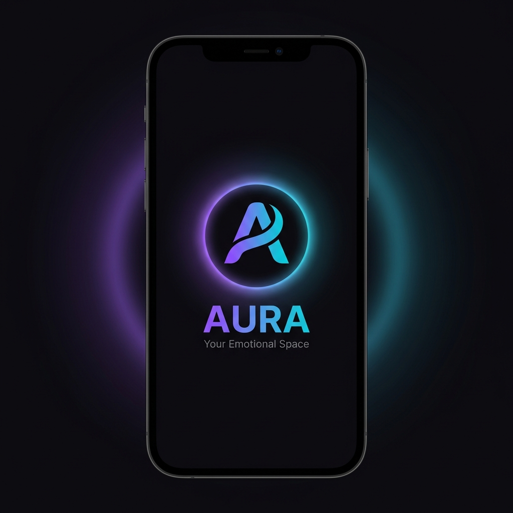
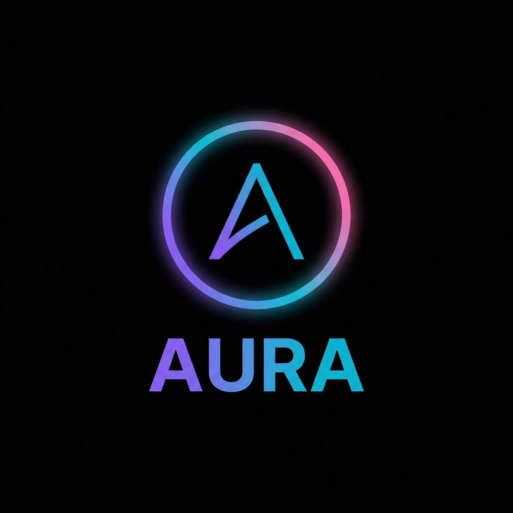
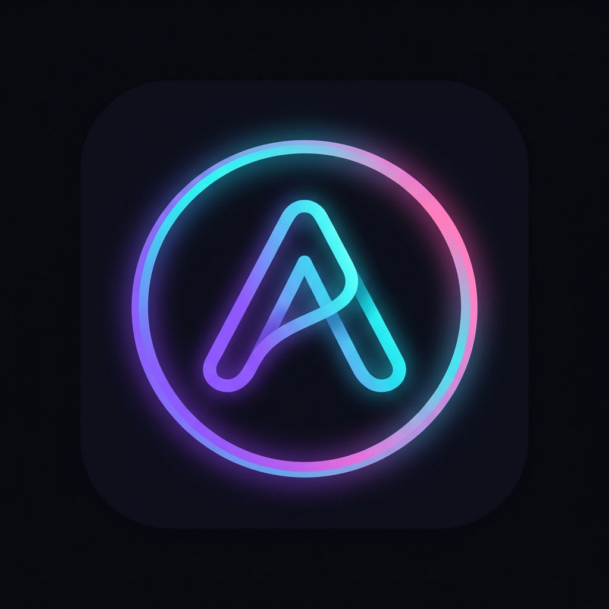

<p align="center">
  
</p>

<h1 align="center">🔮 AURA Social</h1>
<p align="center">
  <strong>Ambient Emotional Intelligence Social Platform</strong><br/>
  <em>"Your emotions shape your feed. Your feed heals your emotions."</em>
</p>

<p align="center">
  
  
  
  
</p>

---

## 📖 Giới Thiệu

**AURA Social** là nền tảng mạng xã hội thế hệ mới sử dụng **AI suy luận cảm xúc (Emotion Inference)** từ hành vi người dùng, tạo ra trải nghiệm cá nhân hóa sâu mà **không cần thao tác thủ công**.

### ✨ Điểm khác biệt

| Mạng xã hội thường | AURA Social |
|---|---|
| Hỏi "Bạn đang cảm thấy gì?" | AI tự hiểu cảm xúc qua hành vi |
| Feed theo lượt like/follow | Feed theo **trạng thái cảm xúc** real-time |
| Gợi ý bạn bè theo sở thích | **Soul Connect** – kết nối theo chiều sâu cảm xúc |
| Group tĩnh | **Emotional Waves** – nhóm tạm thời cùng cảm xúc |

---

## 📱 Giao Diện

### Màn hình chính

<p align="center">
  
</p>

> **Feed** với Emotion Reaction Bar (8 cảm xúc Plutchik) • **Soul Connect** matching • **Chat** real-time • **Profile** với Aura Ring

### Màn hình phụ

<p align="center">
  
</p>

> **Create Post** với mood picker • **Emotional Compass** radar chart • **Waves** nhóm cảm xúc • **Settings** AI toggle

### Splash Screen & Logo

<p align="center">
  
  &nbsp;&nbsp;&nbsp;
  
  &nbsp;&nbsp;&nbsp;
  
</p>

---

## 🏗️ Kiến Trúc Hệ Thống

```
┌─────────────────────────────────────────────────────────────────┐
│                        FLUTTER APP                              │
│  ┌──────────┐ ┌──────────┐ ┌──────────┐ ┌──────────┐          │
│  │   Feed   │ │   Soul   │ │   Chat   │ │ Profile  │          │
│  └────┬─────┘ └────┬─────┘ └────┬─────┘ └────┬─────┘          │
│       │             │            │             │                │
│  ┌────▼─────────────▼────────────▼─────────────▼────┐          │
│  │              Riverpod State Management            │          │
│  └────┬──────────────────────────────┬──────────────┘          │
│       │                              │                          │
│  Firebase SDK                   Dio HTTP Client                 │
└───────┼──────────────────────────────┼──────────────────────────┘
        │                              │
        ▼                              ▼
┌───────────────────┐    ┌────────────────────────────┐
│     FIREBASE      │    │    FASTAPI AI BACKEND      │
│                   │    │                            │
│ • Auth            │    │ • Emotion Inference (8D)   │
│ • Firestore       │    │ • Feed Recommendation      │
│ • Realtime DB     │◄───│ • Content Analysis         │
│ • Cloud Functions │    │ • Soul Connect Matching    │
│ • FCM             │    │ • Wave Detection           │
│                   │    │ • Wellbeing Guard          │
└───────────────────┘    │                            │
                         │ Storage: Cloudflare R2     │
                         └────────────────────────────┘
```

---

## 🧠 AI Features

### 1. Emotion Inference Engine
- **5-layer analysis**: Content → Behavioral → Temporal → Social → Fusion
- **8D emotion vector** theo mô hình Plutchik: Joy, Trust, Anticipation, Surprise, Sadness, Fear, Anger, Disgust
- Suy luận **không xâm phạm** – không hỏi, chỉ quan sát hành vi

### 2. Aura Ring
- Vòng gradient biểu diễn trạng thái cảm xúc real-time
- Màu sắc thay đổi theo emotion vector dominant
- Hiển thị trên avatar ở mọi nơi trong app

### 3. Soul Connect
- Matching dựa trên **emotional compatibility** (cosine similarity)
- Không phải dating – là kết nối **empathy-based**
- Compatibility breakdown với radar chart

### 4. Emotional Waves
- Nhóm tạm thời tự động tạo bởi AI (DBSCAN clustering)
- Gom users cùng emotional state tại cùng thời điểm
- Tự giải tán khi wave qua đi

---

## 📁 Cấu Trúc Dự Án

```
AURA-Social/
│
├── app/                          # 📱 Flutter Mobile App
│   ├── lib/
│   │   ├── core/                 #    Theme, Router, Services
│   │   ├── features/             #    Feature modules (feed, chat, soul...)
│   │   ├── shared/               #    Shared widgets, models
│   │   └── main.dart             #    Entry point
│   └── pubspec.yaml
│
├── fastapi-backend/              # 🤖 AI Processing Server
│   ├── app/
│   │   ├── routers/              #    API endpoints
│   │   ├── services/             #    Business logic + R2 storage
│   │   ├── models/               #    Pydantic schemas
│   │   └── ml/                   #    ML model loader + vector math
│   ├── main.py
│   ├── Dockerfile
│   └── requirements.txt
│
├── docs/                         # 📚 Documentation
│   ├── AURA-System-Design/       #    8 tài liệu thiết kế chi tiết
│   ├── team/                     #    Phân công + khung xương hệ thống
│   └── ui-mockups/               #    Giao diện mẫu + brand kit
│
└── README.md
```

---

## 🛠️ Tech Stack

| Layer | Technology |
|---|---|
| **Frontend** | Flutter 3.19+ • Dart • Riverpod • GoRouter • flutter_animate |
| **AI Backend** | FastAPI • Python 3.11 • HuggingFace Transformers • PyTorch |
| **Database** | Firebase Firestore (structured) + Realtime Database (chat) |
| **Auth** | Firebase Auth (Google Sign-In, Email/Password) |
| **Storage** | Cloudflare R2 (S3-compatible, 10GB free) |
| **Push** | Firebase Cloud Messaging (FCM) |
| **Deploy** | Cloud Run (FastAPI) + Firebase (Rules, Functions) |

---

## 🚀 Quick Start

### Flutter App

```bash
cd app
flutter pub get
flutter run
```

### FastAPI Backend

```bash
cd fastapi-backend
python -m venv venv
.\venv\Scripts\activate          # Windows
pip install -r requirements.txt
cp .env.example .env             # Điền credentials
uvicorn main:app --reload
```

Mở `http://localhost:8080/docs` để xem API documentation.

---

## 👥 Team & Phân Công

| Vai trò | Phạm vi | Focus |
|---|---|---|
| 👑 **Leader** | AI/ML + FastAPI + Firebase + DevOps | Hệ thống cốt lõi |
| 📱 **Person 2** | Flutter Core UI | Auth + Feed + Post + Profile |
| 💬 **Person 3** | Flutter Social | Chat + Soul Connect + Waves |
| ⚙️ **Person 4** | Flutter UX & Features | Tracking + Notifications + Settings + Polish |

> Chi tiết phân công: [`docs/team/PHAN-CONG-CONG-VIEC.md`](docs/team/PHAN-CONG-CONG-VIEC.md)

---

## 📄 Tài Liệu

| Tài liệu | Mô tả |
|---|---|
| [Tổng Quan Hệ Thống](docs/AURA-System-Design/00-TONG-QUAN-HE-THONG.md) | Vision, features, architecture overview |
| [Kiến Trúc Hệ Thống](docs/AURA-System-Design/01-KIEN-TRUC-HE-THONG.md) | Technical architecture chi tiết |
| [Thiết Kế CSDL](docs/AURA-System-Design/02-THIET-KE-CO-SO-DU-LIEU.md) | Firestore + RTDB schema |
| [Module AI](docs/AURA-System-Design/03-MODULE-AI.md) | AI/ML pipeline design |
| [Thiết Kế API](docs/AURA-System-Design/04-THIET-KE-API.md) | FastAPI endpoints spec |
| [Frontend Flutter](docs/AURA-System-Design/05-FRONTEND-FLUTTER.md) | Flutter architecture + components |
| [Bảo Mật](docs/AURA-System-Design/06-BAO-MAT-QUYEN-RIENG-TU.md) | Security rules + privacy |
| [Lộ Trình](docs/AURA-System-Design/07-LO-TRINH-PHAT-TRIEN.md) | Development roadmap |
| [Giao Diện Mẫu](docs/ui-mockups/GIAO-DIEN-MAU.md) | UI mockups + design system |
| [Phân Công](docs/team/PHAN-CONG-CONG-VIEC.md) | Task assignments cho team |
| [Khung Xương](docs/team/KHUNG-XUONG-HE-THONG.md) | System skeleton + starter code |

---

<p align="center">
  Made with 💜 by AURA Team
</p>
