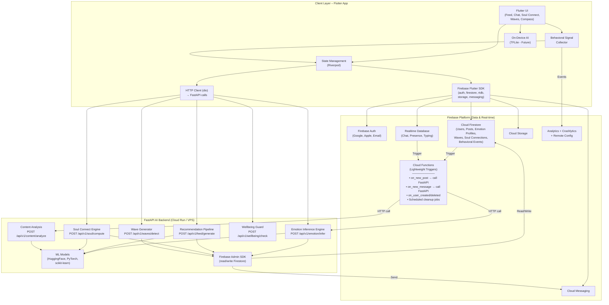
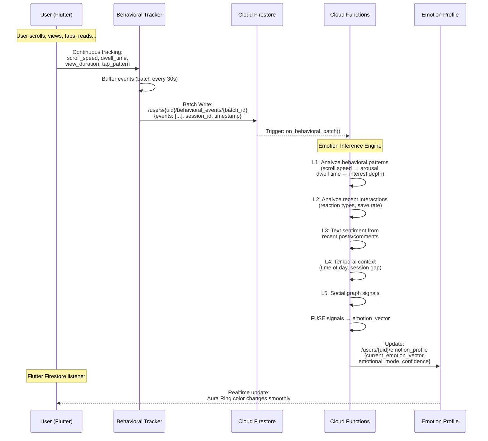
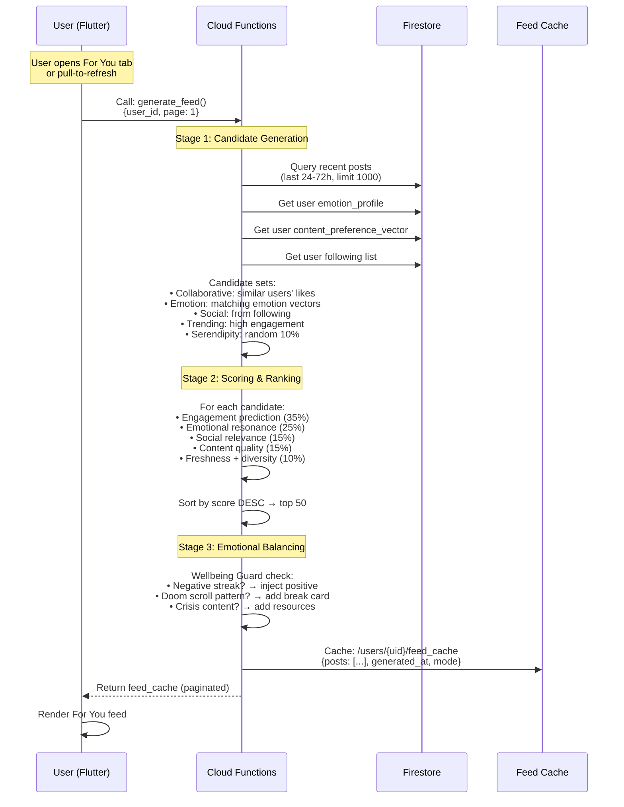
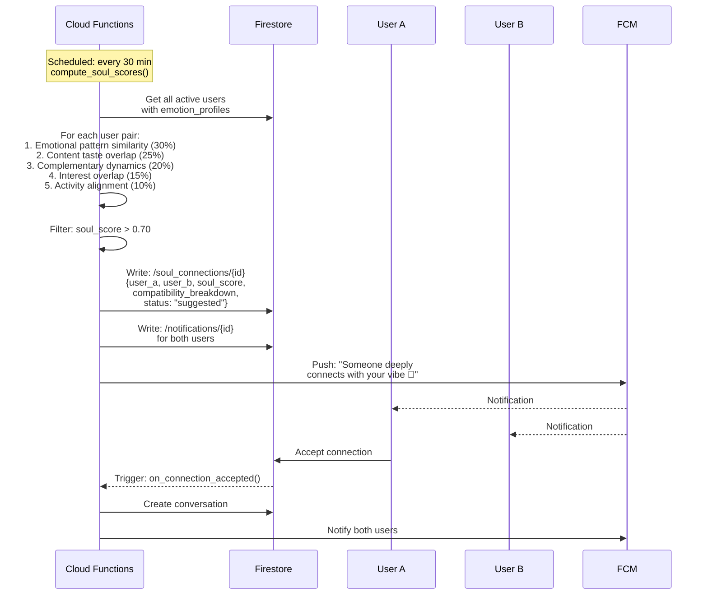
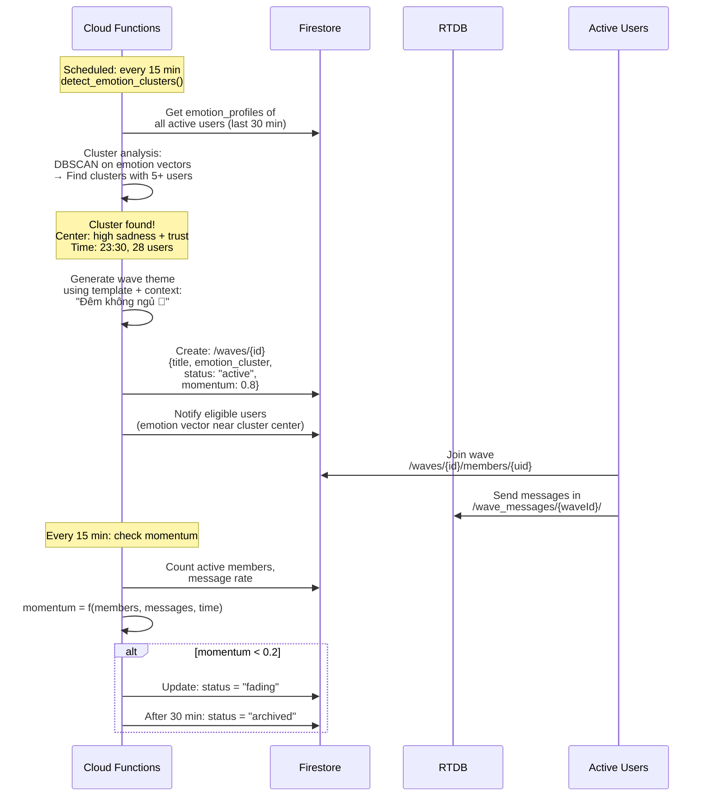
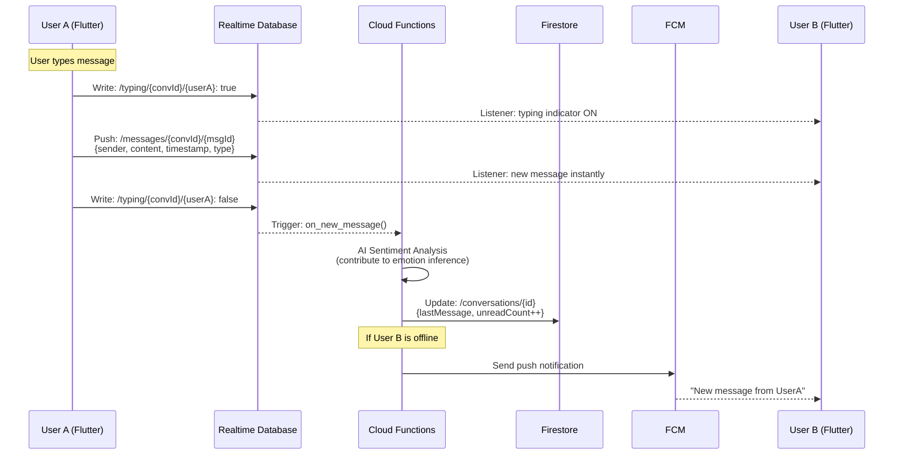
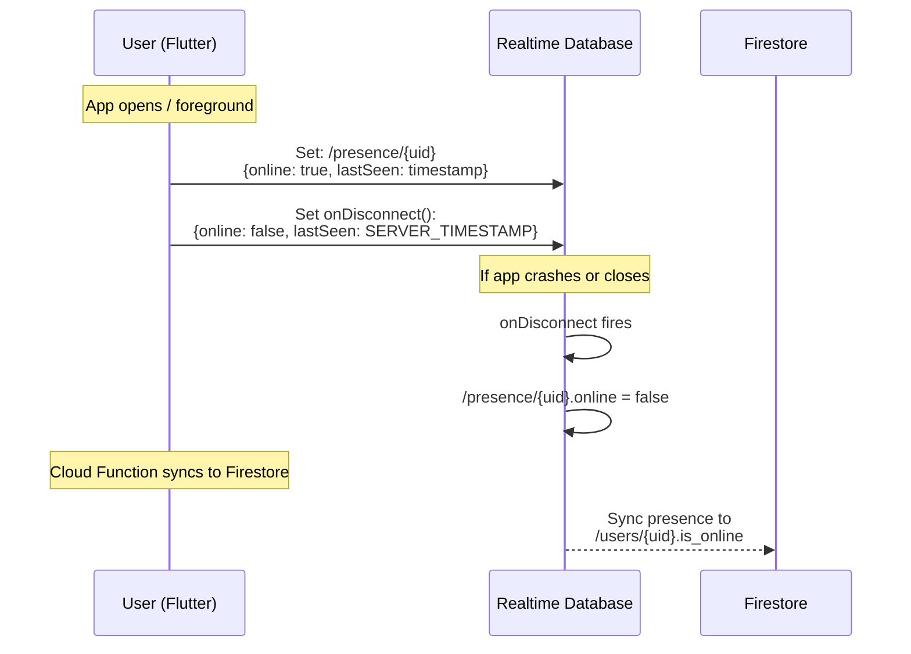
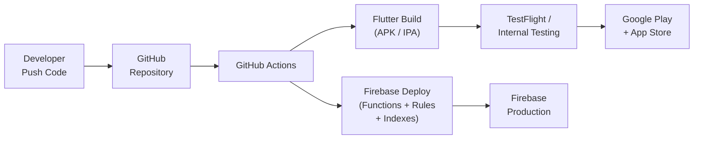

# AURA v3.0 – Kiến Trúc Hệ Thống Chi Tiết

> **Tài liệu:** 01/07 – System Architecture  
> **Phiên bản:** 3.0 (Behavioral AI Edition)

---

## 1. Tổng Quan Kiến Trúc

AURA v3.0 áp dụng kiến trúc **Hybrid**: **Firebase** cho data layer + real-time + authentication, kết hợp **FastAPI (Python)** backend riêng xử lý toàn bộ AI pipeline:

- **Firebase (Data & Real-time)**: Auth, Firestore, RTDB (chat), Storage, FCM, Analytics
- **FastAPI (AI Processing)**: Emotion Inference, Recommendation, Soul Connect, Wave Detection
- **Cloud Functions (Triggers)**: Lightweight event triggers gọi FastAPI khi data thay đổi
- **Real-time native**: Cả Firestore lẫn RTDB đều hỗ trợ listeners
- **Offline-first**: Firestore local cache hoạt động khi mất mạng
- **Behavioral Tracking**: Client-side signal collection → FastAPI analysis
- **Security**: Firebase Security Rules + FastAPI JWT verification

### Tại Sao Hybrid Thay Vì Cloud Functions Only?

| Tiêu chí | Cloud Functions Only | Hybrid (Firebase + FastAPI) |
|---|---|---|
| **Cold Start** | 2-10s delay cho AI functions | ❌ Không có (server always-on) |
| **Memory limit** | Max 8GB | Unlimited |
| **Timeout** | Max 540s | Unlimited |
| **ML Model loading** | Reload mỗi cold start | Load 1 lần, reuse mãi |
| **GPU support** | ❌ Không | ✅ Có (khi deploy trên GPU VPS) |
| **Chi phí ở scale** | Expensive (per-invocation) | Predictable (fixed server cost) |
| **Complexity** | Đơn giản | Phải quản lý server |
| **Real-time triggers** | ✅ Native | Cần Cloud Functions bridge |

---

## 2. Sơ Đồ Kiến Trúc Tổng Thể



---

## 3. Phân Chia Vai Trò Firebase Services

### 3.1 Tại Sao Dùng Cả Firestore VÀ Realtime Database?

| Tiêu chí | Cloud Firestore | Realtime Database |
|---|---|---|
| **Cấu trúc dữ liệu** | Document-based, lồng nhau | JSON tree phẳng |
| **Query phức tạp** | ✅ Composite queries, where, orderBy | ❌ Hạn chế |
| **Offline cache** | ✅ Tự động, mạnh | ⚠️ Có nhưng ít linh hoạt |
| **Real-time speed** | Tốt (ms) | Rất tốt (sub-ms) |
| **Chi phí** | Tính theo reads/writes/deletes | Tính theo bandwidth + storage |
| **Best for** | Structured data, queries phức tạp | High-frequency writes (chat) |

**Phân chia dữ liệu v3.0:**

| Dữ liệu | Lưu ở | Lý do |
|---|---|---|
| Users, Profiles | **Firestore** | Query phức tạp, offline support |
| **Emotion Profiles** | **Firestore** | Query vector-based, AI update |
| Posts, Feed Content | **Firestore** | Query, pagination, AI scoring |
| **Waves (metadata)** | **Firestore** | Query lifecycle, member management |
| Matches (Soul Connect) | **Firestore** | Query trạng thái, scoring history |
| **Behavioral Events** | **Firestore** | Batch writes, AI processing |
| **Recommendation Cache** | **Firestore** | Pre-computed feed per user |
| Notifications | **Firestore** | Query read/unread |
| **Chat Messages** | **RTDB** | Tốc độ write cực nhanh |
| **Online Presence** | **RTDB** | `onDisconnect()` handler native |
| **Typing Indicators** | **RTDB** | High-frequency updates |
| **Wave Chat Messages** | **RTDB** | Group real-time messaging |

### 3.2 Firebase Auth

```
Supported Providers:
├── Email/Password (đăng ký mới)
├── Google Sign-In (nhanh, phổ biến)
├── Apple Sign-In (bắt buộc cho iOS)
└── (Future) Phone Number OTP
```

**Flow:**
1. User đăng ký/đăng nhập qua Firebase Auth
2. Firebase trả về `uid` + ID Token
3. ID Token tự động gắn vào Firestore/RTDB requests
4. Security Rules kiểm tra `request.auth.uid` cho mọi operation

### 3.3 Phân Chia Vai Trò: Cloud Functions vs FastAPI

Kiến trúc Hybrid chia rõ trách nhiệm:

```
┌─────────────────────────────────────┐  ┌──────────────────────────────────────┐
│   CLOUD FUNCTIONS (Lightweight)     │  │   FASTAPI AI BACKEND (Heavy AI)      │
│   Vai trò: Event triggers + sync    │  │   Vai trò: Toàn bộ AI processing     │
│                                     │  │                                      │
│   • on_user_created()               │  │   POST /api/v1/emotion/infer         │
│     → Init user doc + emotion       │  │     → 5-layer behavioral analysis    │
│       profile                       │  │     → Signal fusion → emotion vector │
│                                     │  │     → Emotional mode detection       │
│   • on_user_deleted()               │  │                                      │
│     → GDPR cascade delete           │  │   POST /api/v1/feed/generate         │
│                                     │  │     → Candidate generation (1000+)   │
│   • on_new_post()                   │  │     → Scoring & ranking (50)         │
│     → Call FastAPI /content/analyze  │  │     → Emotional balancing            │
│     → Update post AI fields         │  │     → Wellbeing guard                │
│                                     │  │                                      │
│   • on_new_message()                │  │   POST /api/v1/soul/compute          │
│     → Call FastAPI for sentiment    │  │     → Pattern similarity             │
│     → Update conversation metadata  │  │     → Compatibility scoring          │
│     → Send push notification        │  │                                      │
│                                     │  │   POST /api/v1/soul/suggestions      │
│   • on_wave_member_change()         │  │     → Get top matches for user       │
│     → Update member count           │  │                                      │
│                                     │  │   POST /api/v1/waves/detect          │
│   • on_follow()                     │  │     → DBSCAN clustering              │
│     → Update follower counts        │  │     → Create/update waves            │
│     → Send notification             │  │                                      │
│                                     │  │   POST /api/v1/content/analyze       │
│   SCHEDULED:                        │  │     → Text sentiment analysis        │
│   • cleanup_behavioral_events()     │  │     → Content embedding              │
│   • cleanup_expired_waves()         │  │     → Quality scoring                │
│   • cleanup_old_notifications()     │  │     → Toxicity detection             │
│                                     │  │                                      │
│   Runtime: Python 3.12              │  │   POST /api/v1/wellbeing/check       │
│   Memory: 256MB (lightweight)       │  │     → Doom scroll detection          │
│   Region: asia-southeast1           │  │     → Crisis keyword scan            │
│                                     │  │                                      │
│                                     │  │   GET  /api/v1/prompts/{mode}        │
│                                     │  │     → AI conversation suggestions    │
│                                     │  │                                      │
│                                     │  │   Runtime: Python 3.12 + FastAPI     │
│                                     │  │   Deploy: Cloud Run / Railway / VPS  │
│                                     │  │   Memory: 2-4GB (ML models loaded)   │
│                                     │  │   Region: asia-southeast1            │
└─────────────────────────────────────┘  └──────────────────────────────────────┘
```

### 3.4 FastAPI Server Structure

```
fastapi-backend/
├── main.py                          # FastAPI app + CORS + lifespan
├── requirements.txt
├── Dockerfile                       # For Cloud Run deployment
├── .env                             # Firebase credentials, config
│
├── app/
│   ├── __init__.py
│   ├── config.py                    # Settings, Firebase init
│   ├── auth.py                      # Firebase ID Token verification
│   ├── models/                      # Pydantic request/response models
│   │   ├── emotion.py
│   │   ├── feed.py
│   │   ├── soul.py
│   │   └── wave.py
│   │
│   ├── routers/                     # API route handlers
│   │   ├── emotion.py               # /api/v1/emotion/*
│   │   ├── feed.py                  # /api/v1/feed/*
│   │   ├── soul.py                  # /api/v1/soul/*
│   │   ├── waves.py                 # /api/v1/waves/*
│   │   ├── content.py               # /api/v1/content/*
│   │   ├── wellbeing.py             # /api/v1/wellbeing/*
│   │   └── prompts.py               # /api/v1/prompts/*
│   │
│   ├── services/                    # Business logic
│   │   ├── emotion_inference.py     # ★ Emotion Inference Engine
│   │   ├── recommendation.py        # ★ Deep Recommendation Pipeline
│   │   ├── soul_connect.py          # ★ Soul Connect Engine
│   │   ├── wave_generator.py        # ★ Emotional Wave Generator
│   │   ├── content_analyzer.py      # Text sentiment + embedding
│   │   ├── wellbeing_guard.py       # ★ Wellbeing Guard
│   │   ├── prompt_assistant.py      # AI conversation suggestions
│   │   └── notification.py          # FCM push via Firebase Admin
│   │
│   ├── ml/                          # ML model management
│   │   ├── model_loader.py          # Load models once at startup
│   │   └── vector_math.py           # Cosine similarity, fusion
│   │
│   └── utils/
│       ├── firebase_client.py       # Firebase Admin SDK wrapper
│       ├── constants.py             # Emotion types, thresholds
│       └── helpers.py
│
└── tests/
    ├── test_emotion.py
    ├── test_recommendation.py
    └── test_soul_connect.py
```

### 3.5 FastAPI Authentication (Firebase ID Token)

```python
# app/auth.py
from firebase_admin import auth as firebase_auth
from fastapi import Depends, HTTPException, Header

async def verify_firebase_token(authorization: str = Header(...)) -> dict:
    """
    Verify Firebase ID Token from Flutter client.
    Flutter sends: Authorization: Bearer <idToken>
    """
    try:
        token = authorization.replace("Bearer ", "")
        decoded = firebase_auth.verify_id_token(token)
        return decoded  # Contains uid, email, etc.
    except Exception:
        raise HTTPException(status_code=401, detail="Invalid Firebase token")

# Usage in routers:
@router.post("/api/v1/feed/generate")
async def generate_feed(
    request: FeedRequest,
    user: dict = Depends(verify_firebase_token),
):
    uid = user["uid"]
    # ... generate feed for this user
```

---

## 4. Client Layer – Flutter App

### 4.1 Flutter Package Dependencies

| Package | Vai trò |
|---|---|
| `firebase_core` | Khởi tạo Firebase |
| `firebase_auth` | Authentication |
| `cloud_firestore` | Firestore database |
| `firebase_database` | Realtime Database (chat) |
| `firebase_storage` | Upload/download media |
| `firebase_messaging` | Push notifications |
| `firebase_analytics` | Event tracking (+ behavioral signals) |
| `firebase_crashlytics` | Crash reporting |
| `firebase_remote_config` | Feature flags, AI parameters |
| `flutter_riverpod` | State management |
| `go_router` | Navigation |
| `dio` | **HTTP client → FastAPI AI backend** |
| `cached_network_image` | Image caching |
| `image_picker` | Chọn ảnh |
| `flutter_local_notifications` | Local notification UI |
| `fl_chart` | Charts cho Emotional Compass |
| `lottie` | Animations |
| `tflite_flutter` | (Future) On-device AI inference |

### 4.2 Cấu Trúc Project Flutter

```
aura_app/
├── lib/
│   ├── main.dart
│   ├── app.dart                        # MaterialApp + GoRouter
│   ├── firebase_options.dart           # FlutterFire generated
│   │
│   ├── core/                           # Core utilities
│   │   ├── constants/
│   │   │   ├── app_colors.dart
│   │   │   ├── app_text_styles.dart
│   │   │   ├── emotion_types.dart      # Plutchik 8 emotions
│   │   │   └── aura_config.dart        # AI parameters, thresholds
│   │   ├── theme/
│   │   │   ├── app_theme.dart
│   │   │   └── dark_theme.dart
│   │   ├── utils/
│   │   │   ├── date_utils.dart
│   │   │   ├── validators.dart
│   │   │   └── emotion_utils.dart      # Vector math, color mapping
│   │   ├── models/
│   │   │   ├── emotion_vector.dart     # 8D emotion vector model
│   │   │   ├── emotional_mode.dart     # Enum: uplift, mirror, amplify, chill, explore
│   │   │   └── behavioral_event.dart   # Event model for tracking
│   │   └── widgets/                    # Shared widgets
│   │       ├── aura_ring.dart          # Gradient emotion ring
│   │       ├── aura_card.dart          # Glassmorphism card
│   │       ├── emotion_wheel.dart      # Plutchik reaction wheel
│   │       ├── emotion_radar.dart      # 8-axis radar chart
│   │       └── loading_indicator.dart
│   │
│   ├── services/                       # Cross-feature services
│   │   ├── firebase_service.dart       # Firebase initialization
│   │   ├── notification_service.dart   # FCM handler
│   │   ├── ai_service.dart             # Cloud Function calls
│   │   └── behavioral_tracker.dart     # ★ Behavioral signal collector
│   │
│   ├── features/                       # Feature-based structure
│   │   ├── auth/
│   │   │   ├── data/
│   │   │   │   └── auth_repository.dart
│   │   │   ├── presentation/
│   │   │   │   ├── login_screen.dart
│   │   │   │   ├── register_screen.dart
│   │   │   │   └── widgets/
│   │   │   └── providers/
│   │   │       └── auth_provider.dart
│   │   │
│   │   ├── onboarding/
│   │   │   ├── presentation/
│   │   │   │   ├── setup_profile_screen.dart
│   │   │   │   ├── select_interests_screen.dart
│   │   │   │   └── welcome_screen.dart     # No forced mood check-in!
│   │   │   └── providers/
│   │   │
│   │   ├── feed/                       # ★ For You + Following feeds
│   │   │   ├── data/
│   │   │   │   ├── feed_repository.dart
│   │   │   │   └── recommendation_service.dart
│   │   │   ├── domain/
│   │   │   │   ├── post_model.dart
│   │   │   │   └── feed_config.dart
│   │   │   ├── presentation/
│   │   │   │   ├── for_you_feed_screen.dart
│   │   │   │   ├── following_feed_screen.dart
│   │   │   │   ├── create_post_screen.dart
│   │   │   │   └── widgets/
│   │   │   │       ├── post_card.dart
│   │   │   │       ├── reaction_bar.dart
│   │   │   │       └── wellbeing_break_card.dart
│   │   │   └── providers/
│   │   │       └── feed_provider.dart
│   │   │
│   │   ├── soul_connect/              # ★ Deep matching
│   │   │   ├── data/
│   │   │   │   └── soul_connect_repository.dart
│   │   │   ├── domain/
│   │   │   │   ├── soul_match_model.dart
│   │   │   │   └── compatibility_model.dart
│   │   │   ├── presentation/
│   │   │   │   ├── soul_connect_screen.dart
│   │   │   │   ├── connection_detail_screen.dart
│   │   │   │   └── widgets/
│   │   │   │       ├── soul_card.dart
│   │   │   │       └── compatibility_chart.dart
│   │   │   └── providers/
│   │   │       └── soul_connect_provider.dart
│   │   │
│   │   ├── waves/                     # ★ Emotional Waves
│   │   │   ├── data/
│   │   │   │   └── wave_repository.dart
│   │   │   ├── domain/
│   │   │   │   └── wave_model.dart
│   │   │   ├── presentation/
│   │   │   │   ├── waves_discover_screen.dart
│   │   │   │   ├── wave_chat_screen.dart
│   │   │   │   └── widgets/
│   │   │   │       ├── wave_card.dart
│   │   │   │       └── wave_momentum_indicator.dart
│   │   │   └── providers/
│   │   │       └── wave_provider.dart
│   │   │
│   │   ├── chat/
│   │   │   ├── data/
│   │   │   │   └── chat_repository.dart  # Uses RTDB
│   │   │   ├── domain/
│   │   │   │   ├── message_model.dart
│   │   │   │   └── conversation_model.dart
│   │   │   ├── presentation/
│   │   │   │   ├── conversations_list_screen.dart
│   │   │   │   ├── chat_screen.dart
│   │   │   │   └── widgets/
│   │   │   │       ├── message_bubble.dart
│   │   │   │       ├── chat_input.dart
│   │   │   │       └── typing_indicator.dart
│   │   │   └── providers/
│   │   │       ├── chat_provider.dart
│   │   │       └── presence_provider.dart
│   │   │
│   │   ├── profile/
│   │   │   ├── data/
│   │   │   │   └── profile_repository.dart
│   │   │   ├── presentation/
│   │   │   │   ├── profile_screen.dart
│   │   │   │   ├── edit_profile_screen.dart
│   │   │   │   ├── settings_screen.dart
│   │   │   │   └── ai_settings_screen.dart  # ★ AI feature toggles
│   │   │   └── providers/
│   │   │       └── profile_provider.dart
│   │   │
│   │   ├── emotional_compass/        # ★ Emotional analytics dashboard
│   │   │   ├── data/
│   │   │   │   └── compass_repository.dart
│   │   │   ├── presentation/
│   │   │   │   ├── compass_screen.dart
│   │   │   │   ├── emotion_journey_screen.dart
│   │   │   │   └── widgets/
│   │   │   │       ├── emotion_radar_chart.dart
│   │   │   │       ├── wellbeing_score.dart
│   │   │   │       └── emotion_timeline.dart
│   │   │   └── providers/
│   │   │       └── compass_provider.dart
│   │   │
│   │   ├── mood_expression/           # ★ Optional mood sharing
│   │   │   ├── presentation/
│   │   │   │   └── mood_expression_sheet.dart
│   │   │   └── providers/
│   │   │
│   │   └── notifications/
│   │       ├── data/
│   │       │   └── notification_repository.dart
│   │       ├── presentation/
│   │       │   └── notifications_screen.dart
│   │       └── providers/
│   │           └── notification_provider.dart
│   │
│   └── services/                       # Cross-feature services
│       ├── firebase_service.dart
│       ├── notification_service.dart
│       ├── ai_service.dart
│       └── behavioral_tracker.dart     # ★ Core behavioral signal collection
│
├── assets/
│   ├── images/
│   ├── icons/
│   ├── animations/                     # Lottie files
│   └── fonts/
│
├── test/
├── pubspec.yaml
└── firebase.json
```

---

## 5. Luồng Dữ Liệu Chính

### 5.1 Behavioral Signal Collection → Emotion Inference Flow



### 5.2 Deep Recommendation → For You Feed Flow



### 5.3 Soul Connect Matching Flow



### 5.4 Emotional Wave Lifecycle Flow



### 5.5 Chat Message Flow



### 5.6 Online Presence System



---

## 6. Firebase Project Configuration

### 6.1 Cấu Trúc Firebase Project

```
Firebase Project: aura-social-v3
│
├── Authentication
│   ├── Email/Password: Enabled
│   ├── Google: Enabled
│   └── Apple: Enabled
│
├── Cloud Firestore
│   ├── Region: asia-southeast1 (Singapore)
│   └── Mode: Native
│
├── Realtime Database
│   ├── Region: asia-southeast1
│   └── URL: aura-social-v3-default-rtdb.asia-southeast1.firebasedatabase.app
│
├── Cloud Storage
│   ├── Bucket: aura-social-v3.appspot.com
│   └── Rules: Auth-based access
│
├── Cloud Functions
│   ├── Runtime: Python 3.12
│   ├── Region: asia-southeast1
│   ├── Memory: 256MB (default), 1GB (AI functions), 2GB (recommendation)
│   └── Max instances: 10-50 depending on function
│
├── Cloud Messaging: Enabled
├── Analytics: Enabled (+ custom behavioral events)
├── Crashlytics: Enabled
├── Performance Monitoring: Enabled
└── Remote Config: Enabled (AI parameters, feature flags)
```

### 6.2 Firebase Indexes (Firestore)

```json
{
  "indexes": [
    {
      "collectionGroup": "users",
      "queryScope": "COLLECTION",
      "fields": [
        { "fieldPath": "is_online", "order": "ASCENDING" },
        { "fieldPath": "last_active_at", "order": "DESCENDING" }
      ]
    },
    {
      "collectionGroup": "posts",
      "queryScope": "COLLECTION",
      "fields": [
        { "fieldPath": "created_at", "order": "DESCENDING" },
        { "fieldPath": "quality_score", "order": "DESCENDING" }
      ]
    },
    {
      "collectionGroup": "posts",
      "queryScope": "COLLECTION",
      "fields": [
        { "fieldPath": "user_id", "order": "ASCENDING" },
        { "fieldPath": "created_at", "order": "DESCENDING" }
      ]
    },
    {
      "collectionGroup": "soul_connections",
      "queryScope": "COLLECTION",
      "fields": [
        { "fieldPath": "user_a_id", "order": "ASCENDING" },
        { "fieldPath": "status", "order": "ASCENDING" },
        { "fieldPath": "soul_score", "order": "DESCENDING" }
      ]
    },
    {
      "collectionGroup": "soul_connections",
      "queryScope": "COLLECTION",
      "fields": [
        { "fieldPath": "user_b_id", "order": "ASCENDING" },
        { "fieldPath": "status", "order": "ASCENDING" },
        { "fieldPath": "soul_score", "order": "DESCENDING" }
      ]
    },
    {
      "collectionGroup": "waves",
      "queryScope": "COLLECTION",
      "fields": [
        { "fieldPath": "status", "order": "ASCENDING" },
        { "fieldPath": "momentum", "order": "DESCENDING" }
      ]
    },
    {
      "collectionGroup": "notifications",
      "queryScope": "COLLECTION",
      "fields": [
        { "fieldPath": "user_id", "order": "ASCENDING" },
        { "fieldPath": "is_read", "order": "ASCENDING" },
        { "fieldPath": "created_at", "order": "DESCENDING" }
      ]
    }
  ]
}
```

---

## 7. Scalability & Cost Estimation

### 7.1 Firebase Free Tier (Spark Plan)

| Service | Free Limit | Đủ cho |
|---|---|---|
| Auth | 10K verifications/month | ~10K users |
| Firestore Reads | 50K/day | ~300 DAU |
| Firestore Writes | 20K/day | ~300 DAU |
| Firestore Storage | 1 GB | MVP |
| RTDB Storage | 1 GB | ~50K messages |
| RTDB Downloads | 10 GB/month | MVP |
| Cloud Storage | 5 GB | MVP |
| Cloud Functions Invocations | 2M/month | MVP |
| FCM | Unlimited | ♾️ |

> **Lưu ý v3.0**: Behavioral tracking tạo nhiều writes hơn v2.0. Cần optimize batching.

### 7.2 Growth Phase (Blaze Plan)

| Users (DAU) | Est. Monthly Cost |
|---|---|
| 0 – 300 | **$0** (Free tier) |
| 300 – 3K | **$30 – $120** |
| 3K – 30K | **$120 – $600** |
| 30K – 100K | **$600 – $3,000** |
| 100K+ | Hybrid architecture recommended |

### 7.3 Cost Optimization Strategies v3.0

1. **Behavioral Events**: Batch writes (30s intervals), không ghi từng event
2. **Emotion Profile**: Chỉ update khi vector thay đổi > threshold (0.05)
3. **Feed Cache**: Pre-compute feed, serve from cache, regenerate trên schedule
4. **Firestore Reads**: `getDocFromCache()` trước khi query server
5. **RTDB Chat**: `.limitToLast(50)`, phân trang
6. **Cloud Functions**: Keep-alive ping, minimize cold starts
7. **Storage**: Compress images client-side (max 500KB)
8. **Wave Messages**: Auto-delete sau khi wave archived

---

## 8. Monitoring & Observability

### Custom Analytics Events (v3.0 Behavioral)

```dart
// Core behavioral tracking events
analytics.logEvent(name: 'post_viewed', parameters: {
  'post_id': postId,
  'view_duration_ms': duration, // dwell time
  'scroll_position': scrollRatio, // how far user scrolled
  'source': 'for_you', // which feed
});

analytics.logEvent(name: 'emotion_vector_updated', parameters: {
  'dominant_emotion': 'joy',
  'valence': 0.65,
  'confidence': 0.78,
  'mode': 'explore',
});

analytics.logEvent(name: 'soul_connection_suggested', parameters: {
  'soul_score': 0.85,
  'action': 'accepted', // accepted, rejected, ignored
});

analytics.logEvent(name: 'wave_joined', parameters: {
  'wave_id': waveId,
  'wave_theme': 'late_night',
  'members_at_join': 28,
});

analytics.logEvent(name: 'wellbeing_break_shown', parameters: {
  'trigger': 'negative_streak', // or 'doom_scroll', 'long_session'
  'action': 'took_break', // or 'dismissed'
});
```

---

## 9. Deployment Pipeline



### CI/CD Steps
1. **Push to `develop`**: Auto-deploy Cloud Functions to staging Firebase project
2. **Push to `main`**: Deploy to production Firebase project
3. **Flutter builds**: GitHub Actions → build APK + IPA → upload to stores
4. **Security Rules**: Deployed alongside Cloud Functions
5. **Remote Config**: AI parameters tunable without deploy

---

> **Tài liệu tiếp theo:** [02-THIET-KE-CO-SO-DU-LIEU.md](./02-THIET-KE-CO-SO-DU-LIEU.md)
