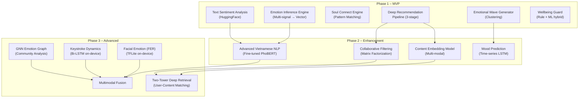

# AURA v3.0 – Module AI/ML Chi Tiết

> **Tài liệu:** 03/07 – AI/ML Modules  
> **Phiên bản:** 3.0 (Behavioral AI Edition)

---

## 1. Tổng Quan Chiến Lược AI v3.0

> **Runtime:** Toàn bộ AI modules chạy trên **FastAPI backend** (Cloud Run / VPS), không phải Cloud Functions.  
> **Lý do:** ML models được load 1 lần khi startup, không bị cold start, unlimited memory/timeout.

### Sự Thay Đổi Từ v2.0

| Khía cạnh | v2.0 | v3.0 |
|---|---|---|
| Input cảm xúc | User tự chọn 1/8 mood | AI suy luận từ 5 lớp tín hiệu |
| Recommendation | Rule-based weighted scoring | Multi-stage deep pipeline |
| Matching | Mood compatibility matrix | Soul Connect (deep pattern matching) |
| Content Analysis | Sentiment pos/neg/neutral | Multi-emotion vector extraction |
| Community | Static rooms | AI-generated Emotional Waves |
| Wellbeing | Không có | Wellbeing Guard tích hợp |

### AI Architecture Overview



---

## 2. AI Module #1: Emotion Inference Engine (CỐT LÕI)

> **Endpoint:** `POST /api/v1/emotion/infer`  
> **Runtime:** FastAPI (always-on, ML models pre-loaded)

### 2.1 Mục Đích
Thay thế Mood Check-In cứng nhắc bằng hệ thống **tự suy luận cảm xúc** từ nhiều tín hiệu hành vi.

### 2.2 Kiến Trúc 5 Lớp Tín Hiệu

```
Input Signals → Feature Extraction → Signal Scoring → Fusion → Emotion Vector
────────────────────────────────────────────────────────────────────────────

Layer 1: BEHAVIORAL (weight: 30%)
├── Scroll speed (px/ms)         → arousal indicator
├── Dwell time per post (sec)    → interest depth
├── Session duration (min)       → engagement level
├── Swipe patterns               → decisiveness/restlessness
├── Interaction frequency        → social energy
└── App open frequency           → emotional need
    
Layer 2: CONTENT INTERACTION (weight: 25%)
├── Like rate                    → positive engagement
├── Save rate                    → deep value recognition
├── Share rate                   → social validation
├── Comment length & tone        → emotional investment
├── Reaction type distribution   → specific emotion expression
│   (joy > trust > sadness...)
└── Skip rate                    → content rejection signal

Layer 3: TEXT SENTIMENT (weight: 25%)
├── Post content                 → explicit emotional expression
├── Comment text                 → reaction emotion
├── Chat message tone            → interpersonal emotion
├── Search queries               → emotional need/curiosity
└── Bio/status updates           → self-identity emotion

Layer 4: TEMPORAL CONTEXT (weight: 10%)
├── Time of day                  → circadian rhythm
├── Day of week                  → weekday/weekend pattern
├── Session gap                  → urgency of emotional need
├── Weather (optional)           → ambient mood influence
└── Season                       → seasonal emotional patterns

Layer 5: SOCIAL GRAPH (weight: 10%)
├── Who they interact with most  → emotional circle
├── Whose content they engage    → emotional influence
├── Community membership         → belonging needs
├── Interaction reciprocity      → relationship health
└── New vs familiar connections  → social exploration
```

### 2.3 Implementation Chi Tiết

```python
# Cloud Function: on_behavioral_batch
# Trigger: Firestore onCreate on users/{userId}/behavioral_events/{batchId}
# Memory: 1GB | Timeout: 60s

from firebase_admin import firestore
from transformers import pipeline
import numpy as np

# === EMOTION VECTOR DIMENSIONS ===
EMOTIONS = ['joy', 'trust', 'anticipation', 'surprise', 
            'sadness', 'fear', 'anger', 'disgust']

class EmotionInferenceEngine:
    """
    Multi-signal emotion inference engine.
    Produces 8D emotion vector + 3 meta-dimensions.
    """
    
    def __init__(self):
        self._sentiment_pipeline = None
    
    def get_sentiment_pipeline(self):
        if self._sentiment_pipeline is None:
            self._sentiment_pipeline = pipeline(
                "sentiment-analysis",
                model="nlptown/bert-base-multilingual-uncased-sentiment",
                max_length=512, truncation=True
            )
        return self._sentiment_pipeline
    
    # ─────────────────────────────────────────
    # Layer 1: Behavioral Signal Analysis
    # ─────────────────────────────────────────
    def analyze_behavioral(self, events: list) -> dict:
        """
        Analyze scroll/dwell/tap patterns to infer emotional state.
        
        Research basis:
        - Fast scrolling + short dwell → restlessness/boredom/anxiety
        - Slow scrolling + long dwell → calm/interested/contemplative
        - High interaction rate → social energy/excitement
        - Low interaction + long session → passive consumption/sadness
        """
        if not events:
            return self._neutral_vector()
        
        scroll_speeds = [e['scroll_speed'] for e in events if 'scroll_speed' in e]
        dwell_times = [e['dwell_time'] for e in events if 'dwell_time' in e]
        interactions = [e for e in events if e.get('type') == 'interaction']
        
        avg_scroll = np.mean(scroll_speeds) if scroll_speeds else 2.0
        avg_dwell = np.mean(dwell_times) if dwell_times else 3.0
        interaction_rate = len(interactions) / max(len(events), 1)
        
        # Map behavioral patterns to emotion indicators
        vector = np.zeros(8)
        
        # Arousal estimation (from scroll speed)
        arousal = min(1.0, avg_scroll / 5.0)  # Normalize: 5 px/ms = max arousal
        
        # Interest depth (from dwell time)
        depth = min(1.0, avg_dwell / 10.0)  # Normalize: 10s = deep interest
        
        # Social energy (from interaction rate)
        social = min(1.0, interaction_rate / 0.3)  # 30% interaction = high
        
        # Pattern → emotion mapping
        if arousal > 0.6 and social > 0.5:
            # Fast + interactive → excitement/anticipation
            vector[0] = 0.4  # joy
            vector[2] = 0.5  # anticipation
            vector[3] = 0.3  # surprise
        elif arousal < 0.3 and depth > 0.6:
            # Slow + deep reading → contemplative/trust
            vector[1] = 0.5  # trust
            vector[0] = 0.3  # joy (content engagement)
        elif arousal > 0.6 and social < 0.2:
            # Fast scrolling, not interacting → boredom/restlessness
            vector[6] = 0.2  # mild anger/frustration
            vector[4] = 0.3  # sadness (unmet need)
        elif arousal < 0.3 and social < 0.2:
            # Slow, passive → sadness/low energy
            vector[4] = 0.5  # sadness
            vector[5] = 0.2  # fear/anxiety
        else:
            # Neutral/mixed
            vector = np.full(8, 0.125)
        
        # Normalize to sum = 1
        vector = vector / (vector.sum() + 1e-6)
        
        return {
            'vector': vector.tolist(),
            'arousal': float(arousal),
            'depth': float(depth),
            'social_energy': float(social),
        }
    
    # ─────────────────────────────────────────
    # Layer 2: Content Interaction Analysis
    # ─────────────────────────────────────────
    def analyze_interactions(self, interactions: dict) -> dict:
        """
        Analyze reaction types, save/share patterns.
        """
        vector = np.zeros(8)
        
        # Reaction type distribution → direct emotion signal
        reaction_counts = interactions.get('reactions', {})
        total_reactions = sum(reaction_counts.values()) or 1
        
        for i, emotion in enumerate(EMOTIONS):
            vector[i] = reaction_counts.get(emotion, 0) / total_reactions
        
        # Save rate → indicates content provides value/comfort
        save_rate = interactions.get('save_rate', 0)
        if save_rate > 0.1:
            vector[1] += 0.1  # trust (values content)
            vector[2] += 0.1  # anticipation (wants to revisit)
        
        # Share rate → social emotional energy
        share_rate = interactions.get('share_rate', 0)
        if share_rate > 0.05:
            vector[0] += 0.1  # joy (wants to spread)
        
        vector = vector / (vector.sum() + 1e-6)
        return {'vector': vector.tolist()}
    
    # ─────────────────────────────────────────
    # Layer 3: Text Sentiment Analysis
    # ─────────────────────────────────────────
    def analyze_texts(self, texts: list) -> dict:
        """
        NLP sentiment analysis on user-generated texts.
        """
        if not texts:
            return {'vector': [0.125] * 8}
        
        pipe = self.get_sentiment_pipeline()
        vector = np.zeros(8)
        
        for text in texts[:10]:  # Limit to 10 most recent
            if len(text.strip()) < 3:
                continue
            result = pipe(text[:512])[0]
            stars = int(result['label'].split()[0])
            confidence = result['score']
            
            if stars >= 4:
                vector[0] += confidence * 0.4   # joy
                vector[1] += confidence * 0.2   # trust
                vector[2] += confidence * 0.2   # anticipation
            elif stars <= 2:
                vector[4] += confidence * 0.4   # sadness
                vector[5] += confidence * 0.2   # fear
                vector[6] += confidence * 0.2   # anger
            else:
                vector[3] += confidence * 0.3   # surprise (neutral/mixed)
                vector[1] += confidence * 0.2   # trust
        
        vector = vector / (vector.sum() + 1e-6)
        return {'vector': vector.tolist()}
    
    # ─────────────────────────────────────────
    # Layer 4: Temporal Context
    # ─────────────────────────────────────────
    def analyze_temporal(self, context: dict) -> dict:
        """
        Time-of-day:
        - Late night (22-04) → more vulnerability, loneliness
        - Morning (06-10) → fresh, motivated
        - Afternoon (14-17) → potential fatigue
        - Evening (18-22) → relaxation, social
        """
        hour = context.get('hour', 12)
        day = context.get('day_of_week', 2)  # 0=Mon ... 6=Sun
        session_gap_hours = context.get('session_gap_hours', 2)
        
        vector = np.full(8, 0.125)  # Start neutral
        
        # Late night adjustment
        if 22 <= hour or hour <= 4:
            vector[4] += 0.1   # sadness tendency
            vector[1] += 0.1   # trust (seeking connection)
        
        # Morning boost
        if 6 <= hour <= 10:
            vector[0] += 0.1   # joy
            vector[2] += 0.1   # anticipation
        
        # Weekend
        if day >= 5:
            vector[0] += 0.05  # slight joy boost
        
        # Frequent return → emotional need
        if session_gap_hours < 0.5:
            vector[5] += 0.05  # slight anxiety
            vector[2] += 0.05  # anticipation
        
        vector = vector / (vector.sum() + 1e-6)
        return {'vector': vector.tolist()}
    
    # ─────────────────────────────────────────
    # Layer 5: Social Graph
    # ─────────────────────────────────────────
    def analyze_social(self, social_data: dict) -> dict:
        """
        Social interaction patterns.
        """
        vector = np.full(8, 0.125)
        
        reciprocity = social_data.get('reciprocity_rate', 0.5)
        if reciprocity < 0.3:
            vector[4] += 0.1  # sadness (one-sided connections)
        elif reciprocity > 0.7:
            vector[1] += 0.1  # trust (mutual connections)
            vector[0] += 0.1  # joy
        
        vector = vector / (vector.sum() + 1e-6)
        return {'vector': vector.tolist()}
    
    # ─────────────────────────────────────────
    # FUSION: Combine all signals
    # ─────────────────────────────────────────
    def fuse_signals(self, behavioral, interaction, text, temporal, social):
        """
        Weighted fusion of all signal layers → final emotion vector.
        """
        weights = {
            'behavioral': 0.30,
            'interaction': 0.25,
            'text': 0.25,
            'temporal': 0.10,
            'social': 0.10,
        }
        
        signals = {
            'behavioral': np.array(behavioral['vector']),
            'interaction': np.array(interaction['vector']),
            'text': np.array(text['vector']),
            'temporal': np.array(temporal['vector']),
            'social': np.array(social['vector']),
        }
        
        fused = np.zeros(8)
        total_weight = 0
        for key, weight in weights.items():
            fused += signals[key] * weight
            total_weight += weight
        
        fused = fused / (fused.sum() + 1e-6)
        
        # Calculate meta-dimensions
        # Valence = (positive emotions - negative emotions)
        valence = (fused[0] + fused[1] + fused[2] + fused[3]) - \
                  (fused[4] + fused[5] + fused[6] + fused[7])
        
        # Arousal = high-energy emotions
        arousal = fused[0] + fused[2] + fused[3] + fused[6]  # joy, anticipation, surprise, anger
        
        # Dominance = assertive emotions
        dominance = fused[0] + fused[2] + fused[6]  # joy, anticipation, anger
        
        return {
            'vector': {EMOTIONS[i]: round(float(fused[i]), 4) for i in range(8)},
            'valence': round(float(valence), 4),
            'arousal': round(float(min(1.0, arousal)), 4),
            'dominance': round(float(min(1.0, dominance)), 4),
        }
    
    # ─────────────────────────────────────────
    # Emotional Mode Detection
    # ─────────────────────────────────────────
    def detect_emotional_mode(self, emotion_vector: dict, weekly_trend: dict) -> str:
        """
        Determine what type of content the user needs.
        THIS IS AURA'S CORE DIFFERENTIATOR.
        """
        valence = emotion_vector['valence']
        arousal = emotion_vector['arousal']
        stability = weekly_trend.get('stability_score', 0.5)
        
        if valence < -0.3 and stability < 0.4:
            return "gentle_uplift"      # Prolonged sadness → gentle positive
        elif valence < -0.3 and stability >= 0.4:
            return "empathetic_mirror"  # Temporary sadness → empathy + comfort
        elif valence > 0.5 and arousal > 0.6:
            return "amplify"            # Happy + excited → matching energy
        elif arousal < 0.3:
            return "deep_chill"         # Low energy → calm, deep content
        else:
            return "explore"            # Neutral → diverse discovery
    
    def _neutral_vector(self):
        return {'vector': [0.125] * 8}
```

### 2.4 Confidence Score & Calibration

```python
def calculate_confidence(signals_available: dict) -> float:
    """
    Confidence = how much data we have to infer emotion.
    New users start low, grows over time.
    """
    base_confidence = 0.3  # minimum
    
    if signals_available.get('behavioral_events', 0) > 10:
        base_confidence += 0.15
    if signals_available.get('interactions', 0) > 5:
        base_confidence += 0.15
    if signals_available.get('texts', 0) > 0:
        base_confidence += 0.15
    if signals_available.get('sessions', 0) > 3:
        base_confidence += 0.10
    if signals_available.get('mood_expression'):  # user voluntarily shared
        base_confidence += 0.15
    
    return min(1.0, base_confidence)
```

> **Mood Expression boost**: Khi user TỰ NGUYỆN chia sẻ mood (optional), confidence tăng +0.15 và signal này được weight cao hơn trong fusion.

---

## 3. AI Module #2: Deep Recommendation Pipeline

> **Endpoint:** `POST /api/v1/feed/generate`  
> **Runtime:** FastAPI (always-on, pre-computed models)

### 3.1 Mục Đích
Thay thế feed đơn giản (sort by time) bằng thuật toán đề xuất 3 giai đoạn, tương tự TikTok/Instagram nhưng tích hợp **Emotional Intelligence**.

### 3.2 Pipeline Architecture

```
┌──────────────────────────────────────────────────────────────────────┐
│                    DEEP RECOMMENDATION PIPELINE                      │
│                                                                      │
│  ┌────────────────┐  ┌─────────────────┐  ┌──────────────────────┐  │
│  │ Stage 1:       │  │ Stage 2:        │  │ Stage 3:             │  │
│  │ CANDIDATE      │→│ SCORING &       │→│ EMOTIONAL            │  │
│  │ GENERATION     │  │ RANKING         │  │ BALANCING            │  │
│  │                │  │                 │  │                      │  │
│  │ Pool: ~1000    │  │ Rank: ~50       │  │ Final: ~20-30        │  │
│  │                │  │                 │  │                      │  │
│  │ Sources:       │  │ Factors:        │  │ Guards:              │  │
│  │ • Collaborative│  │ • Engagement 35%│  │ • Negative limit     │  │
│  │ • Emotion-based│  │ • Emotion   25% │  │ • Echo chamber break │  │
│  │ • Social graph │  │ • Social    15% │  │ • Doom scroll detect │  │
│  │ • Trending     │  │ • Quality   15% │  │ • Break card inject  │  │
│  │ • Serendipity  │  │ • Fresh     10% │  │ • Crisis resource    │  │
│  └────────────────┘  └─────────────────┘  └──────────────────────┘  │
└──────────────────────────────────────────────────────────────────────┘
```

### 3.3 Stage 1: Candidate Generation

```python
async def generate_candidates(user_id: str, user_profile: dict, db) -> list:
    """
    Generate ~1000 candidate posts from multiple sources.
    """
    candidates = []
    
    # Source 1: Emotion-based Retrieval (30% of candidates)
    # Posts whose emotion vectors are close to user's emotion
    user_emotion = user_profile.get('current_emotion_vector', {})
    emotional_mode = user_profile.get('emotional_mode', 'explore')
    
    emotion_candidates = await get_emotion_aligned_posts(
        user_emotion=user_emotion,
        mode=emotional_mode,
        limit=300,
        db=db,
    )
    candidates.extend(emotion_candidates)
    
    # Source 2: Social Graph (25% of candidates)
    # Posts from followed users + friends-of-friends
    following = user_profile.get('following_ids', [])
    social_candidates = await get_social_posts(
        following_ids=following,
        limit=250,
        db=db,
    )
    candidates.extend(social_candidates)
    
    # Source 3: Collaborative Filtering (20% of candidates)
    # Posts liked by users with similar content_preference_vector
    similar_users = await find_similar_users(
        user_embedding=user_profile.get('content_preference_vector', []),
        limit=50,
        db=db,
    )
    collab_candidates = await get_posts_from_users(similar_users, limit=200, db=db)
    candidates.extend(collab_candidates)
    
    # Source 4: Trending Content (15% of candidates)
    trending = await get_trending_posts(limit=150, db=db)
    candidates.extend(trending)
    
    # Source 5: Serendipity Pool (10% of candidates)
    # Random high-quality posts for exploration
    random_posts = await get_random_quality_posts(limit=100, db=db)
    candidates.extend(random_posts)
    
    # Deduplicate
    seen_ids = set()
    unique_candidates = []
    for post in candidates:
        if post['post_id'] not in seen_ids:
            seen_ids.add(post['post_id'])
            unique_candidates.append(post)
    
    return unique_candidates
```

### 3.4 Stage 2: Scoring & Ranking

```python
def score_post(user_profile: dict, post: dict, context: dict) -> float:
    """
    Multi-factor scoring for each candidate post.
    Returns score 0.0 - 1.0.
    """
    
    # Factor 1: Engagement Prediction (35%)
    # Based on content_preference_vector similarity
    user_pref = np.array(user_profile.get('content_preference_vector', [0]*64))
    post_embed = np.array(post.get('content_embedding', [0]*64))
    
    if np.linalg.norm(user_pref) > 0 and np.linalg.norm(post_embed) > 0:
        engagement_score = float(np.dot(user_pref, post_embed) / 
                                (np.linalg.norm(user_pref) * np.linalg.norm(post_embed) + 1e-6))
        engagement_score = (engagement_score + 1) / 2  # Normalize to [0, 1]
    else:
        engagement_score = 0.5
    
    # Factor 2: Emotional Resonance (25%)
    emotional_mode = user_profile.get('emotional_mode', 'explore')
    user_emotion = user_profile.get('current_emotion_vector', {})
    post_emotion = post.get('ai_emotion_vector', {})
    
    emotion_score = calculate_emotional_resonance(
        user_emotion, post_emotion, emotional_mode
    )
    
    # Factor 3: Social Relevance (15%)
    is_following = post['user_id'] in user_profile.get('following_ids', [])
    mutual_communities = len(
        set(user_profile.get('wave_history', [])) & 
        set(post.get('author_wave_history', []))
    )
    social_score = 0.0
    if is_following:
        social_score += 0.6
    social_score += min(0.4, mutual_communities * 0.1)
    
    # Factor 4: Content Quality (15%)
    quality_score = post.get('quality_score', 0.5)
    
    # Factor 5: Freshness & Diversity (10%)
    hours_old = (context['now'] - post['created_at']).total_seconds() / 3600
    freshness = max(0, 1.0 - (hours_old / 72))  # Decay over 72 hours
    diversity_bonus = context.get('diversity_bonus', 0)
    variety_score = freshness * 0.6 + diversity_bonus * 0.4
    
    # FINAL SCORE
    total = (
        engagement_score * 0.35 +
        emotion_score * 0.25 +
        social_score * 0.15 +
        quality_score * 0.15 +
        variety_score * 0.10
    )
    
    return round(total, 4)


def calculate_emotional_resonance(user_emotion, post_emotion, mode):
    """
    Calculate how well a post resonates with user's emotional state.
    THIS IS AURA'S UNIQUE ALGORITHM.
    """
    if not user_emotion or not post_emotion:
        return 0.5
    
    user_vec = np.array([user_emotion.get(e, 0.125) for e in EMOTIONS])
    post_vec = np.array([post_emotion.get(e, 0.125) for e in EMOTIONS])
    
    # Cosine similarity between emotion vectors
    similarity = float(np.dot(user_vec, post_vec) / 
                       (np.linalg.norm(user_vec) * np.linalg.norm(post_vec) + 1e-6))
    
    if mode == "empathetic_mirror":
        # Show content that mirrors current emotion (empathy)
        return (similarity + 1) / 2
    
    elif mode == "gentle_uplift":
        # Show content slightly more positive than current state
        post_valence = sum(post_vec[:4]) - sum(post_vec[4:])
        user_valence = sum(user_vec[:4]) - sum(user_vec[4:])
        # Prefer posts 0.1-0.3 more positive than user
        uplift_gap = post_valence - user_valence
        if 0.1 <= uplift_gap <= 0.4:
            return 0.9  # Perfect uplift
        elif 0 < uplift_gap < 0.1:
            return 0.7  # Too similar
        elif uplift_gap > 0.4:
            return 0.5  # Too different (jarring)
        else:
            return 0.3  # More negative (bad)
    
    elif mode == "amplify":
        # Match high energy
        return (similarity + 1) / 2
    
    elif mode == "deep_chill":
        # Calm, contemplative content
        chill_score = post_vec[1] + post_vec[0]  # trust + joy
        high_energy = post_vec[6] + post_vec[3]  # anger + surprise
        return min(1.0, chill_score * 2 - high_energy)
    
    else:  # "explore"
        # Diversity – slightly penalize too-similar content
        return 0.5 + (1 - similarity) * 0.3
```

### 3.5 Stage 3: Emotional Balancing (Wellbeing Guard)

```python
def apply_wellbeing_guard(ranked_posts: list, user_profile: dict) -> list:
    """
    Final pass: ensure feed is emotionally balanced.
    AURA's ethical differentiator.
    """
    final_feed = []
    negative_streak = 0
    max_negative_streak = 3  # Max consecutive negative posts
    
    for post in ranked_posts:
        post_valence = post.get('ai_valence', 0)
        
        if post_valence < -0.3:
            negative_streak += 1
            if negative_streak > max_negative_streak:
                # Inject a positive/neutral content breaker
                final_feed.append(create_positive_break_card())
                negative_streak = 0
                continue
        else:
            negative_streak = 0
        
        final_feed.append(post)
    
    # Doom scroll detection
    user_session_time = user_profile.get('current_session_minutes', 0)
    if user_session_time > 30:
        # Insert a gentle break suggestion every 30 min
        if not any(p.get('type') == 'break_card' for p in final_feed[:5]):
            final_feed.insert(5, create_break_suggestion_card())
    
    # Crisis content detection
    for post in final_feed:
        if post.get('crisis_detected'):
            post['crisis_resources'] = get_crisis_resources()
    
    return final_feed


def create_positive_break_card():
    return {
        'type': 'break_card',
        'variant': 'positive_inject',
        'title': '✨ Góc tươi sáng',
        'subtitle': 'Đây là lúc tốt để nhìn vào điều tích cực',
    }


def create_break_suggestion_card():
    return {
        'type': 'break_card',
        'variant': 'session_break',
        'title': '🌊 Nghỉ ngơi chút nha',
        'subtitle': 'Bạn đã online khá lâu. Uống nước, hít thở sâu nào!',
    }
```

---

## 4. AI Module #3: Soul Connect Engine

> **Endpoints:** `POST /api/v1/soul/compute` (batch) + `POST /api/v1/soul/suggestions` (client)  
> **Runtime:** FastAPI

### 4.1 Mục Đích
Thay thế rule-based mood matching bằng **deep compatibility scoring** dựa trên toàn bộ emotional profile.

### 4.2 Implementation

```python
class SoulConnectEngine:
    """
    Deep compatibility matching between users.
    Uses emotional patterns, content taste, and behavioral alignment.
    """
    
    def calculate_soul_score(self, user_a: dict, user_b: dict) -> dict:
        """
        Calculate deep compatibility score between two users.
        Returns score + breakdown.
        """
        
        # 1. Emotional Pattern Similarity (30%)
        pattern_sim = self._pattern_similarity(
            user_a.get('weekly_emotion_pattern', []),
            user_b.get('weekly_emotion_pattern', []),
        )
        
        # 2. Content Taste Overlap (25%)
        taste_sim = self._cosine_similarity(
            user_a.get('content_preference_vector', []),
            user_b.get('content_preference_vector', []),
        )
        
        # 3. Complementary Emotional Dynamics (20%)
        complementary = self._emotional_complementarity(
            user_a.get('current_emotion_vector', {}),
            user_b.get('current_emotion_vector', {}),
        )
        
        # 4. Interest Overlap (15%)
        interests_a = set(user_a.get('interests', []))
        interests_b = set(user_b.get('interests', []))
        if interests_a and interests_b:
            interest_sim = len(interests_a & interests_b) / len(interests_a | interests_b)
        else:
            interest_sim = 0.3
        
        # 5. Activity Alignment (10%)
        activity_sim = self._activity_alignment(
            user_a.get('peak_activity_hours', []),
            user_b.get('peak_activity_hours', []),
        )
        
        soul_score = (
            pattern_sim * 0.30 +
            taste_sim * 0.25 +
            complementary * 0.20 +
            interest_sim * 0.15 +
            activity_sim * 0.10
        )
        
        # Determine connection reason
        factors = {
            'emotional_pattern': pattern_sim,
            'content_taste': taste_sim,
            'complementary': complementary,
            'interests': interest_sim,
            'activity': activity_sim,
        }
        reason = max(factors, key=factors.get)
        
        return {
            'soul_score': round(soul_score, 3),
            'breakdown': {k: round(v, 3) for k, v in factors.items()},
            'reason': reason,
            'connection_type': self._get_connection_type(factors),
        }
    
    def _pattern_similarity(self, pattern_a: list, pattern_b: list) -> float:
        """Compare weekly emotion patterns (7 days × 8 emotions)."""
        if not pattern_a or not pattern_b:
            return 0.5
        a = np.array(pattern_a).flatten()
        b = np.array(pattern_b).flatten()
        if np.linalg.norm(a) == 0 or np.linalg.norm(b) == 0:
            return 0.5
        return float((np.dot(a, b) / (np.linalg.norm(a) * np.linalg.norm(b)) + 1) / 2)
    
    def _cosine_similarity(self, vec_a: list, vec_b: list) -> float:
        if not vec_a or not vec_b:
            return 0.5
        a, b = np.array(vec_a), np.array(vec_b)
        if np.linalg.norm(a) == 0 or np.linalg.norm(b) == 0:
            return 0.5
        return float((np.dot(a, b) / (np.linalg.norm(a) * np.linalg.norm(b)) + 1) / 2)
    
    def _emotional_complementarity(self, emo_a: dict, emo_b: dict) -> float:
        """
        Check if emotions complement each other.
        E.g., someone sad pairs well with someone supportive/calm.
        """
        if not emo_a or not emo_b:
            return 0.5
        
        valence_a = emo_a.get('valence', 0)
        valence_b = emo_b.get('valence', 0)
        
        # Both positive → good (shared joy)
        if valence_a > 0.3 and valence_b > 0.3:
            return 0.8
        
        # One negative, one positive-calm → good (support dynamic)
        if (valence_a < -0.2 and valence_b > 0.2) or \
           (valence_b < -0.2 and valence_a > 0.2):
            trust_score = max(
                emo_a.get('trust', 0),
                emo_b.get('trust', 0),
            )
            return 0.7 + trust_score * 0.2
        
        # Both negative → moderate (mutual support but risky)
        if valence_a < -0.2 and valence_b < -0.2:
            return 0.4
        
        return 0.5  # Neutral
    
    def _activity_alignment(self, hours_a: list, hours_b: list) -> float:
        """Check if users are active at similar times."""
        if not hours_a or not hours_b:
            return 0.5
        overlap = len(set(hours_a) & set(hours_b))
        max_possible = max(len(hours_a), len(hours_b), 1)
        return overlap / max_possible
    
    def _get_connection_type(self, factors: dict) -> str:
        """Human-readable connection type for UI."""
        top = max(factors, key=factors.get)
        return {
            'emotional_pattern': 'Kindred Spirit',      # Tâm hồn đồng điệu
            'content_taste': 'Taste Twin',               # Đồng sở thích
            'complementary': 'Supportive Match',          # Bổ trợ cảm xúc
            'interests': 'Interest Buddy',               # Bạn cùng đam mê
            'activity': 'Night Owl Buddy',               # Cùng nhịp sống
        }.get(top, 'Vibe Match')
```

---

## 5. AI Module #4: Emotional Wave Generator

> **Endpoint:** `POST /api/v1/waves/detect`  
> **Runtime:** FastAPI (called by Cloud Scheduler → Cloud Function → FastAPI)

### 5.1 Mục Đích
Tự động tạo cộng đồng tạm thời (ephemeral) khi phát hiện cluster cảm xúc trong cộng đồng.

### 5.2 Implementation

```python
from sklearn.cluster import DBSCAN

class EmotionalWaveGenerator:
    """
    Automatically detect emotional clusters and create ephemeral communities.
    """
    
    MIN_CLUSTER_SIZE = 5
    MAX_WAVE_MEMBERS = 50
    MOMENTUM_DECAY_RATE = 0.1  # per 15 min without activity
    
    def detect_and_create_waves(self, active_users: list, db):
        """
        Scan active users, find emotional clusters, create waves.
        Called every 15 minutes by scheduled function.
        """
        if len(active_users) < self.MIN_CLUSTER_SIZE:
            return []
        
        # Extract emotion vectors
        vectors = []
        user_ids = []
        for user in active_users:
            ev = user.get('current_emotion_vector', {})
            vec = [ev.get(e, 0.125) for e in EMOTIONS]
            vectors.append(vec)
            user_ids.append(user['uid'])
        
        X = np.array(vectors)
        
        # DBSCAN clustering (no need to specify k)
        clustering = DBSCAN(eps=0.15, min_samples=self.MIN_CLUSTER_SIZE)
        labels = clustering.fit_predict(X)
        
        new_waves = []
        for cluster_id in set(labels):
            if cluster_id == -1:  # Noise
                continue
            
            member_indices = np.where(labels == cluster_id)[0]
            cluster_vectors = X[member_indices]
            cluster_users = [user_ids[i] for i in member_indices]
            
            if len(cluster_users) > self.MAX_WAVE_MEMBERS:
                cluster_users = cluster_users[:self.MAX_WAVE_MEMBERS]
            
            center = cluster_vectors.mean(axis=0)
            
            wave = {
                'emotion_cluster_center': {
                    EMOTIONS[i]: round(float(center[i]), 4) for i in range(8)
                },
                'eligible_users': cluster_users,
                'member_count': len(cluster_users),
                'momentum': 0.8,  # Start strong
                'status': 'active',
            }
            
            # Generate theme
            wave.update(self.generate_theme(center))
            new_waves.append(wave)
        
        return new_waves
    
    def generate_theme(self, center_vector: np.ndarray) -> dict:
        """
        Generate wave title and emoji based on emotion cluster center.
        """
        dominant_idx = np.argmax(center_vector)
        dominant = EMOTIONS[dominant_idx]
        
        # Get current time context
        from datetime import datetime
        hour = datetime.now().hour
        
        themes = {
            'joy': {
                'titles': ['Happy Hour ✨', 'Good Vibes Only 🌈', 'Celebration Corner 🎉'],
                'emoji': '🌟',
            },
            'trust': {
                'titles': ['Safe Space 🤗', 'Heart to Heart 💜', 'Trust Circle 🫂'],
                'emoji': '💜',
            },
            'anticipation': {
                'titles': ['Dreamers Club 🚀', 'Future Vibes ⚡', 'What If...? 💭'],
                'emoji': '🚀',
            },
            'surprise': {
                'titles': ['Mind Blown! 🤯', 'Discovery Zone 🔮', 'Plot Twist Corner 😱'],
                'emoji': '🔮',
            },
            'sadness': {
                'titles': ['Rainy Day ☔', 'Nơi Để Buồn 💧', 'Đêm Không Ngủ 🌊'],
                'emoji': '🌊',
            },
            'fear': {
                'titles': ['Overthinking Club 💭', 'Anxiety Corner 🌙', 'Late Night Worries 😰'],
                'emoji': '🌙',
            },
            'anger': {
                'titles': ['Vent Space 🔥', 'Frustration Station 💪', 'Let It Out 😤'],
                'emoji': '🔥',
            },
            'disgust': {
                'titles': ['Reality Check 🎭', 'No Filter Zone 🙅', 'Honest Hour 💯'],
                'emoji': '🎭',
            },
        }
        
        theme = themes.get(dominant, themes['trust'])
        
        # Late night special
        if 22 <= hour or hour <= 4:
            if dominant in ['sadness', 'fear']:
                return {
                    'title': 'Đêm Không Ngủ 🌊',
                    'emoji': '🌊',
                    'description': 'Dành cho những ai đang thức khuya và cần ai đó trò chuyện',
                }
        
        import random
        title = random.choice(theme['titles'])
        
        return {
            'title': title,
            'emoji': theme['emoji'],
            'description': f'Cộng đồng cho những ai đang cảm thấy {dominant}',
        }
    
    def update_momentum(self, wave_data: dict, recent_activity: dict) -> float:
        """
        Update wave momentum based on activity.
        momentum = 0 → wave dies, momentum = 1 → wave thrives.
        """
        current_momentum = wave_data.get('momentum', 0.5)
        
        # Activity factors
        members_active = recent_activity.get('active_members_15min', 0)
        messages_15min = recent_activity.get('messages_15min', 0)
        new_joins = recent_activity.get('new_joins_15min', 0)
        
        # Momentum growth
        if messages_15min > 10:
            current_momentum += 0.1
        elif messages_15min > 5:
            current_momentum += 0.05
        
        if new_joins > 2:
            current_momentum += 0.05
        
        # Momentum decay
        if members_active < 3:
            current_momentum -= 0.15
        elif messages_15min == 0:
            current_momentum -= self.MOMENTUM_DECAY_RATE
        
        return max(0, min(1.0, current_momentum))
```

---

## 6. AI Module #5: Content Analysis & Embedding

> **Endpoint:** `POST /api/v1/content/analyze`  
> **Runtime:** FastAPI (called by Cloud Function `on_new_post` trigger)

### 6.1 Text Sentiment → Emotion Vector

```python
def analyze_post_content(content: str) -> dict:
    """
    Analyze post text → extract emotion vector + embedding.
    Used for both user emotion inference and content matching.
    """
    pipe = get_sentiment_pipeline()
    
    if not content or len(content.strip()) < 3:
        return {
            'ai_emotion_vector': {e: 0.125 for e in EMOTIONS},
            'ai_valence': 0.0,
            'ai_sentiment': 'neutral',
            'ai_sentiment_score': 0.0,
        }
    
    result = pipe(content[:512])[0]
    stars = int(result['label'].split()[0])
    score = result['score']
    
    emotion_vector = {}
    if stars >= 4:
        emotion_vector = {
            'joy': 0.35, 'trust': 0.20, 'anticipation': 0.20,
            'surprise': 0.10, 'sadness': 0.05, 'fear': 0.03,
            'anger': 0.02, 'disgust': 0.05,
        }
        sentiment = 'positive'
        valence = score * (stars / 5)
    elif stars <= 2:
        emotion_vector = {
            'joy': 0.05, 'trust': 0.05, 'anticipation': 0.05,
            'surprise': 0.10, 'sadness': 0.35, 'fear': 0.15,
            'anger': 0.15, 'disgust': 0.10,
        }
        sentiment = 'negative'
        valence = -score * ((6 - stars) / 5)
    else:
        emotion_vector = {e: 0.125 for e in EMOTIONS}
        sentiment = 'neutral'
        valence = 0.0
    
    return {
        'ai_emotion_vector': emotion_vector,
        'ai_valence': round(valence, 3),
        'ai_sentiment': sentiment,
        'ai_sentiment_score': round(valence, 3),
        'quality_score': calculate_quality_score(content),
    }


def calculate_quality_score(content: str) -> float:
    """
    Basic content quality heuristic.
    Phase 2: replace with ML model.
    """
    score = 0.5
    # Length bonus (10-200 chars is ideal)
    if 10 <= len(content) <= 200:
        score += 0.15
    elif len(content) > 200:
        score += 0.1
    # Has meaningful content (not just emoji)
    alpha_ratio = sum(c.isalpha() for c in content) / max(len(content), 1)
    if alpha_ratio > 0.5:
        score += 0.1
    return min(1.0, score)
```

---

## 7. AI Module #6: AI Prompt Assistant

> **Endpoint:** `GET /api/v1/prompts/{mode}`  
> **Runtime:** FastAPI

```python
MOOD_PROMPTS = {
    "gentle_uplift": [
        "Hôm nay bạn có điều gì vui không? Dù nhỏ thôi cũng được 🌟",
        "Kể mình nghe một bài hát làm bạn thấy tốt hơn đi 🎵",
        "Nếu bạn có thể ở bất cứ đâu lúc này, bạn sẽ chọn đâu? 🌊",
    ],
    "empathetic_mirror": [
        "Mình cũng đang có những lúc như vậy. Bạn muốn nói chuyện không? 💜",
        "Không sao cả, đôi khi chỉ cần có ai đó lắng nghe là đủ 🤗",
        "Chia sẻ với mình đi, mình sẵn sàng nghe bạn.",
    ],
    "amplify": [
        "OMG năng lượng của bạn cực kỳ! Chuyện gì vậy? 🔥",
        "Nhanh kể mình nghe 3 điều bạn đang hype lúc này! 🚀",
        "Vibes này phải chia sẻ cho mọi người! 🌈",
    ],
    "deep_chill": [
        "Bạn đang nghe gì thế? 🎧",
        "Nếu được teleport đến một nơi nào đó để relax, bạn chọn đâu? 🏖️",
        "Show mình coi, bạn đang xem gì hay hay? 📺",
    ],
    "explore": [
        "Nếu phải học một kỹ năng random hôm nay, bạn chọn gì? 🤔",
        "Truth or dare? 👀",
        "Mô tả cuộc sống của bạn bằng 3 emoji thôi 😂",
    ],
}

def get_contextual_suggestions(emotional_mode: str, count: int = 3) -> list:
    """Get AI suggestions based on current emotional mode."""
    import random
    prompts = MOOD_PROMPTS.get(emotional_mode, MOOD_PROMPTS['explore'])
    return random.sample(prompts, min(count, len(prompts)))
```

---

## 8. Hybrid Deployment Architecture

### 8.1 FastAPI AI Backend

Toàn bộ AI modules chạy trên **FastAPI server** (deployed on Cloud Run / VPS):

```python
# main.py - FastAPI App
from contextlib import asynccontextmanager
from fastapi import FastAPI

@asynccontextmanager
async def lifespan(app: FastAPI):
    """Load ML models ONCE at startup."""
    from app.ml.model_loader import ModelLoader
    app.state.models = ModelLoader()
    app.state.models.load_all()  # HuggingFace, embeddings, etc.
    print("✅ All ML models loaded")
    yield

app = FastAPI(title="AURA AI Backend", version="3.0.0", lifespan=lifespan)

# Register all AI routers
from app.routers import emotion, feed, soul, waves, content, wellbeing, prompts
app.include_router(emotion.router, prefix="/api/v1/emotion")
app.include_router(feed.router, prefix="/api/v1/feed")
app.include_router(soul.router, prefix="/api/v1/soul")
app.include_router(waves.router, prefix="/api/v1/waves")
app.include_router(content.router, prefix="/api/v1/content")
app.include_router(wellbeing.router, prefix="/api/v1/wellbeing")
app.include_router(prompts.router, prefix="/api/v1/prompts")
```

**Deployment:** Docker → Cloud Run (asia-southeast1), min 1 instance (no cold start).

### 8.2 Cloud Functions (Lightweight Triggers)

Cloud Functions **chỉ** làm event bridge, KHÔNG chạy AI:

```python
from firebase_functions import firestore_fn, scheduler_fn, options
import requests
import os

FASTAPI_URL = os.environ.get("FASTAPI_URL")
INTERNAL_KEY = os.environ.get("INTERNAL_API_KEY")

# Trigger: new post → call FastAPI for content analysis
@firestore_fn.on_document_created(
    document="posts/{postId}",
    region="asia-southeast1",
    memory=options.MemoryOption.MB_256,  # Lightweight!
)
def on_new_post(event):
    post = event.data.to_dict()
    resp = requests.post(
        f"{FASTAPI_URL}/api/v1/content/analyze",
        json={"content": post.get("content", "")},
        headers={"X-Internal-Key": INTERNAL_KEY},
        timeout=30,
    )
    if resp.ok:
        event.data.reference.update(resp.json())

# Scheduled: trigger soul compute every 30 min
@scheduler_fn.on_schedule(
    schedule="every 30 minutes",
    region="asia-southeast1",
    memory=options.MemoryOption.MB_256,
)
def trigger_soul_compute(event):
    requests.post(f"{FASTAPI_URL}/api/v1/soul/compute",
                  headers={"X-Internal-Key": INTERNAL_KEY}, timeout=300)

# Scheduled: trigger wave detection every 15 min
@scheduler_fn.on_schedule(
    schedule="every 15 minutes",
    region="asia-southeast1",
    memory=options.MemoryOption.MB_256,
)
def trigger_wave_detect(event):
    requests.post(f"{FASTAPI_URL}/api/v1/waves/detect",
                  headers={"X-Internal-Key": INTERNAL_KEY}, timeout=120)
```

### 8.3 FastAPI Directory Structure

```
fastapi-backend/
├── main.py                          # FastAPI app
├── requirements.txt
├── Dockerfile
├── app/
│   ├── auth.py                      # Firebase ID Token verification
│   ├── routers/                     # API endpoints
│   │   ├── emotion.py, feed.py, soul.py, waves.py,
│   │   ├── content.py, wellbeing.py, prompts.py
│   ├── services/                    # Business logic (AI modules)
│   │   ├── emotion_inference.py     # ★ Emotion Inference Engine
│   │   ├── recommendation.py        # ★ Deep Recommendation Pipeline
│   │   ├── soul_connect.py          # ★ Soul Connect Engine
│   │   ├── wave_generator.py        # ★ Emotional Wave Generator
│   │   ├── content_analyzer.py      # Text sentiment + embedding
│   │   ├── wellbeing_guard.py       # ★ Wellbeing Guard
│   │   └── prompt_assistant.py      # AI conversation prompts
│   ├── ml/
│   │   ├── model_loader.py          # Load models once at startup
│   │   └── vector_math.py           # Cosine similarity, fusion
│   └── utils/
│       ├── firebase_client.py       # Firebase Admin SDK
│       └── constants.py
└── tests/
```

### 8.4 Requirements (FastAPI Backend)

```txt
fastapi>=0.109.0
uvicorn>=0.27.0
firebase-admin>=6.3.0
transformers>=4.38.0
torch>=2.1.2
numpy>=1.26.4
scikit-learn>=1.4.0
pydantic>=2.6.0
python-dotenv>=1.0.0
httpx>=0.26.0
slowapi>=0.1.9
```

---

## 9. Model Training & Data Strategy

### 9.1 Training Data Sources

| Model | Data Source | Volume | Phương pháp |
|---|---|---|---|
| Sentiment (MVP) | Pre-trained (HuggingFace) | N/A | Zero-shot |
| Sentiment (Phase 2) | VLSP 2016 + UIT-VSFC + User feedback | ~50K samples | Fine-tuning |
| Emotion Inference | User behavioral data + emotion expressions | Growing | Online learning |
| Content Embedding | Post content + engagement data | Growing | Contrastive learning |
| Soul Connect | Accept/reject signals from users | Growing | Implicit feedback |
| FER (Phase 3) | FER2013 + AffectNet | ~35K images | Transfer learning |
| Keystroke (Phase 3) | Opt-in user data | ~500 sessions | Supervised |

### 9.2 Data Collection Ethics

| Nguyên tắc | Triển khai |
|---|---|
| **Behavioral data = anonymized** | Behavioral events không chứa content, chỉ timing data |
| **Opt-in for advanced** | FER, Keystroke cần user bật trong Settings |
| **Transparency** | Hiển thị "🤖 AI đang hiểu bạn..." icon khi inference |
| **No raw data upload** | FER chạy on-device, chỉ gửi vector |
| **User correction** | User có thể sửa/override AI emotion anytime |
| **Data retention** | Behavioral events: 30 days → aggregate → delete raw |
| **Emotion Profile** | User có thể xem và xóa emotion profile bất kỳ lúc nào |

---

> **Tài liệu tiếp theo:** [04-THIET-KE-API.md](./04-THIET-KE-API.md)
