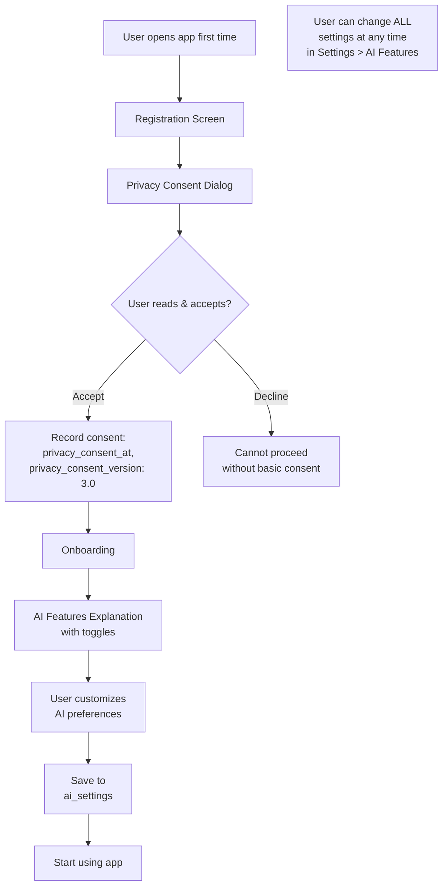

# AURA v3.0 – Bảo Mật & Quyền Riêng Tư Chi Tiết

> **Tài liệu:** 06/07 – Security & Privacy  
> **Phiên bản:** 3.0 (Behavioral AI Edition)

---

## 1. Tổng Quan Bảo Mật v3.0

### Thay Đổi Từ v2.0
AURA v3.0 thu thập **nhiều dữ liệu hành vi hơn** so với v2.0, do đó yêu cầu bảo mật và quyền riêng tư **nghiêm ngặt hơn**:

| Dữ liệu mới v3.0 | Mức độ nhạy cảm | Biện pháp |
|---|---|---|
| Behavioral events (scroll, dwell, tap) | Trung bình | Anonymized, 30-day retention, batch only |
| Emotion vector (AI-inferred) | **Cao** | User-visible, correctable, deletable |
| Content preference embedding | Trung bình | No PII, internal use only |
| Emotional mode detection | **Cao** | Transparent to user, override-able |
| Soul compatibility scores | Cao | Participants-only access |
| Wave membership | Thấp | Public for discovery |

### Nguyên Tắc Bảo Mật Cốt Lõi

| # | Nguyên tắc | Triển khai |
|---|---|---|
| 1 | **Transparency** | Luôn hiển thị khi AI đang hoạt động ("🤖 Đang hiểu bạn...") |
| 2 | **User Control** | User có thể tắt/bật từng tính năng AI trong Settings |
| 3 | **Data Minimization** | Chỉ thu thập dữ liệu cần thiết, behavioral events = timing only |
| 4 | **Purpose Limitation** | Dữ liệu hành vi CHỈ dùng cho emotion inference, KHÔNG bán cho bên thứ 3 |
| 5 | **Right to Erasure** | User xóa tài khoản → tất cả dữ liệu bị xóa (GDPR) |
| 6 | **Consent-First** | Behavioral tracking cần consent khi đăng ký, có thể rút bất kỳ lúc nào |
| 7 | **Security by Design** | Firebase Security Rules + FastAPI JWT verification + encrypted storage |

---

## 2. Firebase Security Architecture

### 2.1 Authentication Security (Hybrid)

```
Authentication Flow (Hybrid):
────────────────────────────────
                                    ┌───► Firestore/RTDB Security Rules
User → Firebase Auth → ID Token ───┤     (verify request.auth.uid)
                                    │
                                    └───► FastAPI Backend
                                         (verify_firebase_token)
                                         Authorization: Bearer <idToken>

Cloud Function → FastAPI:
────────────────────────────────
Cloud Function → FastAPI AI Backend
                   (X-Internal-Key header)
                   Server-to-server auth
```

**Biện pháp:**
- ID Token tự động expire sau 1 giờ → refresh token
- Firebase Auth tự quản lý password hashing (bcrypt)
- Multi-factor authentication (MFA) available (Phase 2)
- Rate limiting: 100 auth attempts/IP/hour (Firebase default)

### 2.2 Firestore Security Rules Summary

| Collection | Read | Write | Ghi chú |
|---|---|---|---|
| `users/{uid}` | Auth users | Owner only | System fields blocked |
| `users/{uid}/emotion_profile` | Owner only | **FastAPI** (via Admin SDK) | Sensitive data |
| `users/{uid}/behavioral_events` | **FastAPI** only | Owner (create only) | Write-only cho client |
| `users/{uid}/feed_cache` | Owner only | **FastAPI** only | Pre-computed |
| `posts` | Auth users | Owner (create/update/delete) | AI fields blocked |
| `posts/{id}/comments` | Auth users | Owner (create/delete) | |
| `soul_connections` | Participants only | FastAPI create, participants accept/reject | |
| `waves` | Auth users | **FastAPI** only | Lifecycle managed by AI |
| `waves/{id}/members` | Auth users | Self join/leave | |
| `conversations` | Participants only | CF create, participants update | |
| `notifications` | Owner only | CF/FastAPI create, owner mark read | |
| `reports` | Never | Auth users create | |

### 2.3 RTDB Security Rules Summary

| Path | Read | Write | Ghi chú |
|---|---|---|---|
| `messages/{convId}` | Participants only | Participants, validate sender | |
| `typing/{convId}` | Participants | Self only | |
| `presence/{uid}` | Auth users | Self only | |
| `wave_messages/{waveId}` | Auth users | Auth users, validate sender | |

---

## 3. Bảo Vệ Dữ Liệu Cảm Xúc

### 3.1 Phân Loại Dữ Liệu Nhạy Cảm

```
┌──────────────────────────────────────────────────────┐
│                  EMOTION DATA TIERS                   │
│                                                      │
│  Tier 1: PUBLIC (visible to others)                  │
│  ├── Display name, avatar, bio                       │
│  ├── Aura Ring (dominant emotion visualization)      │
│  ├── Post content + reactions                        │
│  └── Wave membership                                 │
│                                                      │
│  Tier 2: SEMI-PRIVATE (visible to connections)       │
│  ├── Online status                                   │
│  ├── Connection type badges                          │
│  └── Shared interests                                │
│                                                      │
│  Tier 3: PRIVATE (owner only)                        │
│  ├── Full emotion vector (8D)                        │
│  ├── Emotional mode                                  │
│  ├── Behavioral fingerprint                          │
│  ├── Content preference vector                       │
│  ├── Weekly emotional patterns                       │
│  ├── Wellbeing score                                 │
│  ├── AI insights                                     │
│  └── Soul compatibility breakdowns                   │
│                                                      │
│  Tier 4: SYSTEM ONLY (no user access)                │
│  ├── Raw behavioral events (after processing)        │
│  ├── ML model weights/parameters                     │
│  ├── Feed scoring internals                          │
│  └── Moderation flags                                │
└──────────────────────────────────────────────────────┘
```

### 3.2 Dữ Liệu Hành Vi (Behavioral Events)

**Nguyên tắc thu thập:**

| Quy tắc | Chi tiết |
|---|---|
| **Không chứa nội dung** | Behavioral events CHỈ ghi timing data (dwell_time, scroll_speed), KHÔNG ghi nội dung post/message |
| **Batch only** | Ghi mỗi 30 giây, không real-time streaming |
| **30-day retention** | Raw events tự động xóa sau 30 ngày, chỉ giữ aggregated data |
| **Client-gated** | User tắt `behavioral_tracking_enabled` → client ngừng ghi |
| **No cross-app** | KHÔNG track hành vi ngoài app |
| **Anonymized aggregates** | Community trends sử dụng dữ liệu anonymous, không traceable |

### 3.3 User Control Panel (AI Settings Screen)

```dart
// Settings > AI Features
class AISettingsScreen extends StatelessWidget {
  @override
  Widget build(BuildContext context) {
    return SettingsPage(
      title: 'AI Features',
      sections: [
        SettingsSection(
          title: 'Emotion Intelligence',
          tiles: [
            SettingsToggle(
              title: 'Emotion Inference',
              subtitle: 'AI tự động hiểu cảm xúc từ hành vi của bạn',
              field: 'ai_settings.emotion_inference_enabled',
              icon: Icons.psychology,
            ),
            SettingsToggle(
              title: 'Behavioral Tracking',
              subtitle: 'Thu thập dữ liệu scroll/view để cải thiện đề xuất',
              field: 'ai_settings.behavioral_tracking_enabled',
              icon: Icons.track_changes,
            ),
            SettingsToggle(
              title: 'Wellbeing Guard',
              subtitle: 'AI bảo vệ sức khỏe tâm lý khi dùng app',
              field: 'ai_settings.wellbeing_guard_enabled',
              icon: Icons.shield_outlined,
            ),
          ],
        ),
        SettingsSection(
          title: 'Social Features',
          tiles: [
            SettingsToggle(
              title: 'Soul Connect',
              subtitle: 'Nhận đề xuất kết nối dựa trên emotional matching',
              field: 'ai_settings.soul_connect_enabled',
              icon: Icons.favorite_border,
            ),
            SettingsToggle(
              title: 'Aura Ring Visible',
              subtitle: 'Hiển thị vòng hào quang cảm xúc cho người khác thấy',
              field: 'ai_settings.aura_ring_visible',
              icon: Icons.visibility,
            ),
            SettingsToggle(
              title: 'Mood Expression',
              subtitle: 'Cho phép chia sẻ tâm trạng thủ công (tùy chọn)',
              field: 'ai_settings.mood_expression_enabled',
              icon: Icons.emoji_emotions,
            ),
          ],
        ),
        SettingsSection(
          title: 'Data Management',
          tiles: [
            SettingsAction(
              title: 'Xem Emotion Profile của tôi',
              icon: Icons.data_exploration,
              onTap: () => context.push('/compass'),
            ),
            SettingsAction(
              title: 'Xóa dữ liệu hành vi',
              subtitle: 'Xóa tất cả behavioral events đã thu thập',
              icon: Icons.delete_sweep,
              isDangerous: true,
              onTap: () => _confirmDeleteBehavioralData(context),
            ),
            SettingsAction(
              title: 'Reset Emotion Profile',
              subtitle: 'Xóa toàn bộ emotion profile, bắt đầu lại từ đầu',
              icon: Icons.restart_alt,
              isDangerous: true,
              onTap: () => _confirmResetEmotionProfile(context),
            ),
            SettingsAction(
              title: 'Xóa tài khoản',
              subtitle: 'Xóa vĩnh viễn tất cả dữ liệu (không phục hồi được)',
              icon: Icons.person_remove,
              isDangerous: true,
              onTap: () => _confirmDeleteAccount(context),
            ),
          ],
        ),
      ],
    );
  }
}
```

---

## 4. Tuân Thủ Pháp Lý

### 4.1 GDPR (General Data Protection Regulation)

| Quyền GDPR | Triển khai trong AURA v3.0 |
|---|---|
| **Right to Access** | User xem toàn bộ emotion profile trong Emotional Compass |
| **Right to Rectification** | User override AI emotion bất kỳ lúc nào |
| **Right to Erasure** | "Xóa tài khoản" → Cloud Function cascade delete ALL data |
| **Right to Restriction** | Toggle từng tính năng AI on/off trong Settings |
| **Right to Portability** | Export function (Phase 2): Download all personal data as JSON |
| **Right to Object** | Opt-out khỏi behavioral tracking, soul connect, wellbeing guard |
| **Consent** | Clear consent dialog khi đăng ký, version tracking |

### 4.2 EU AI Act Compliance

| Yêu cầu | Triển khai |
|---|---|
| **Transparency** | "🤖 Đang hiểu bạn..." indicator cho AI inference |
| **Human Oversight** | User có thể override AI emotion, tắt tính năng |
| **Risk Classification** | Emotion AI = "limited risk" → transparency obligations |
| **Data Governance** | 30-day behavioral retention, anonymized aggregates |
| **Technical Documentation** | Tài liệu mô tả algorithm (tài liệu 03) |
| **Non-Discrimination** | Emotion inference không sử dụng demographic data (age, gender, race) |

### 4.3 Consent Flow



---

## 5. Content Moderation

### 5.1 Multi-Layer Moderation

```
Layer 1: AI PRE-FILTER (Automatic)
├── Text toxicity detection (on post/comment creation)
├── Crisis keyword detection (on post/message)
├── Spam detection (frequency + content analysis)
└── Image moderation (Phase 2: Cloud Vision API)

Layer 2: COMMUNITY REPORTING
├── User reports (reason + description)
├── Auto-flag at 3+ reports
├── Queue for manual review

Layer 3: MANUAL REVIEW (Admin)
├── Admin panel (Phase 2)
├── Review queued content
├── Actions: dismiss / hide / remove / ban
└── Appeal process
```

### 5.2 Toxicity Detection (MVP)

```python
def check_toxicity(text: str) -> dict:
    """
    Basic toxicity check using keyword + sentiment.
    Phase 2: Fine-tuned model for Vietnamese.
    """
    # Vietnamese keywords (sensitive)
    crisis_keywords = [
        'tự tử', 'muốn chết', 'không muốn sống', 'tự hại',
        'suicide', 'kill myself', 'end my life',
    ]
    
    toxic_keywords = [
        # Harassment, hate speech patterns
        # Configured via Remote Config for easy updates
    ]
    
    result = {
        'is_toxic': False,
        'toxicity_score': 0.0,
        'crisis_detected': False,
        'flags': [],
    }
    
    text_lower = text.lower()
    
    # Crisis detection
    for keyword in crisis_keywords:
        if keyword in text_lower:
            result['crisis_detected'] = True
            result['flags'].append('crisis_keyword')
            break
    
    # Toxicity scoring
    for keyword in toxic_keywords:
        if keyword in text_lower:
            result['is_toxic'] = True
            result['toxicity_score'] = 0.8
            result['flags'].append('toxic_keyword')
            break
    
    # Sentiment-based (extremely negative)
    if not result['is_toxic']:
        pipe = get_sentiment_pipeline()
        sentiment = pipe(text[:512])[0]
        stars = int(sentiment['label'].split()[0])
        if stars == 1 and sentiment['score'] > 0.9:
            result['toxicity_score'] = 0.5
            result['flags'].append('extreme_negative_sentiment')
    
    return result
```

### 5.3 Crisis Response Protocol

```
When crisis content detected:
─────────────────────────────

1. IMMEDIATE (in-app):
   ├── Show crisis resources card
   │   "Bạn không cô đơn. Hãy liên hệ:
   │    • Tổng đài sức khỏe tâm thần: 1800 599 920 (miễn phí)
   │    • Đường dây nóng: 1900 0027"
   ├── Do NOT block the post (user needs to express)
   └── Add crisis resources to post/conversation

2. FLAGGING (background):
   ├── Flag in moderation queue
   ├── Alert admin (Phase 2)
   └── Log event (anonymized) for trend monitoring

3. FOLLOW-UP (Phase 2):
   ├── Gentle wellbeing check-in after 24h
   └── Connect with support communities
```

---

## 6. Data Storage Security

### 6.1 Firebase Cloud Storage Rules

```javascript
rules_version = '2';
service firebase.storage {
  match /b/{bucket}/o {
    // Helper: check auth
    function isAuthenticated() {
      return request.auth != null;
    }
    
    // Avatars: owner write, anyone read
    match /avatars/{userId}/{fileName} {
      allow read: if isAuthenticated();
      allow write: if isAuthenticated() && 
                      request.auth.uid == userId &&
                      request.resource.size < 2 * 1024 * 1024 && // max 2MB
                      request.resource.contentType.matches('image/.*');
    }
    
    // Post media: owner write, anyone read
    match /posts/{postId}/{fileName} {
      allow read: if isAuthenticated();
      allow write: if isAuthenticated() &&
                      request.resource.size < 10 * 1024 * 1024 && // max 10MB
                      (request.resource.contentType.matches('image/.*') ||
                       request.resource.contentType.matches('video/.*'));
    }
  }
}
```

### 6.2 Data Encryption

| Layer | Encryption | Provider |
|---|---|---|
| **In Transit** | TLS 1.3 | Firebase default |
| **At Rest (Firestore)** | AES-256 | Google Cloud default |
| **At Rest (RTDB)** | AES-256 | Google Cloud default |
| **At Rest (Storage)** | AES-256 | Google Cloud default |
| **Auth credentials** | bcrypt hash | Firebase Auth |
| **ID Tokens** | JWT RS256 | Firebase Auth |

---

## 7. API Security (Hybrid Architecture)

### 7.1 FastAPI Authentication (Client → FastAPI)

Flutter client gọi FastAPI với Firebase ID Token:

```python
# app/auth.py
from firebase_admin import auth as firebase_auth
from fastapi import Depends, HTTPException, Header

async def verify_firebase_token(authorization: str = Header(...)) -> dict:
    """
    Verify Firebase ID Token from Flutter client.
    Flutter sends: Authorization: Bearer <idToken>
    """
    try:
        token = authorization.replace("Bearer ", "")
        decoded = firebase_auth.verify_id_token(token)
        return decoded  # Contains uid, email, etc.
    except firebase_auth.InvalidIdTokenError:
        raise HTTPException(status_code=401, detail="Invalid token")
    except firebase_auth.ExpiredIdTokenError:
        raise HTTPException(status_code=401, detail="Token expired")
    except Exception:
        raise HTTPException(status_code=401, detail="Authentication failed")
```

### 7.2 Internal Auth (Cloud Functions → FastAPI)

Cloud Functions gọi FastAPI với shared secret key:

```python
# app/auth.py
import os

async def verify_internal_key(x_internal_key: str = Header(...)):
    """
    Verify that request comes from our Cloud Functions.
    INTERNAL_API_KEY is set in both Cloud Functions and FastAPI env.
    """
    if x_internal_key != os.environ.get("INTERNAL_API_KEY"):
        raise HTTPException(status_code=403, detail="Invalid internal key")
    return True
```

**Luư trữ key:**
- Cloud Functions: `firebase functions:config:set api.internal_key="<secret>"`
- FastAPI: `.env` file hoặc Cloud Run Secret Manager
- Key rotation: Mỗi 90 ngày

### 7.3 Cloud Functions Auth

```python
def verify_auth(req):
    """All callable functions MUST verify auth."""
    if not req.auth:
        raise https_fn.HttpsError(
            code=https_fn.FunctionsErrorCode.UNAUTHENTICATED,
            message="Authentication required"
        )
    return req.auth.uid
```

### 7.4 Rate Limiting (FastAPI)

```python
from slowapi import Limiter
from slowapi.util import get_remote_address

limiter = Limiter(key_func=get_remote_address)

# Rate limits per endpoint
RATE_LIMITS = {
    'feed_generate': '10/minute',
    'soul_suggestions': '5/minute',
    'emotion_infer': '2/minute',
    'wellbeing_check': '5/minute',
}

@router.post("/generate")
@limiter.limit(RATE_LIMITS['feed_generate'])
async def generate_feed(request: Request, ...):
    ...
```

### 7.5 CORS & Transport Security

```python
app.add_middleware(
    CORSMiddleware,
    allow_origins=["*"],          # Restrict in production
    allow_credentials=True,
    allow_methods=["GET", "POST"],
    allow_headers=["*"],
)
```

- **HTTPS only**: Cloud Run enforces HTTPS
- **TLS 1.3**: All connections encrypted
- **No credentials in URL**: Tokens in headers only

### 7.6 FastAPI Firestore Access (Admin SDK)

FastAPI đọc/ghi Firestore qua **Firebase Admin SDK** (server-side, bypass Security Rules):

```python
# app/utils/firebase_client.py
import firebase_admin
from firebase_admin import credentials, firestore

def init_firebase():
    cred = credentials.Certificate("service-account.json")
    firebase_admin.initialize_app(cred)

def get_firestore_client():
    return firestore.client()
```

> ⚠️ **Quan trọng:** FastAPI có **full access** vào Firestore (vì dùng Admin SDK). Vì vậy, cần:
> - Validate mọi input bằng Pydantic models
> - Kiểm tra `uid` từ Firebase token trước khi truy cập dữ liệu
> - Không bao giờ tin tưởng client input

---

## 8. Security Checklist

| # | Kiểm tra | Trạng thái |
|---|---|---|
| 1 | Firebase Security Rules deployed cho Firestore | ⬜ |
| 2 | Firebase Security Rules deployed cho RTDB | ⬜ |
| 3 | Cloud Storage Security Rules deployed | ⬜ |
| 4 | Authentication providers configured | ⬜ |
| 5 | **FastAPI verify_firebase_token on all endpoints** | ⬜ |
| 6 | **FastAPI verify_internal_key for CF → FastAPI calls** | ⬜ |
| 7 | **FastAPI rate limiting (slowapi) configured** | ⬜ |
| 8 | **FastAPI HTTPS enforced (Cloud Run)** | ⬜ |
| 9 | **INTERNAL_API_KEY securely stored** | ⬜ |
| 10 | Cloud Functions verify `req.auth` | ⬜ |
| 11 | Behavioral data: 30-day retention enforced | ⬜ |
| 12 | Privacy consent flow implemented | ⬜ |
| 13 | AI Settings toggle functional | ⬜ |
| 14 | Account deletion cascade tested | ⬜ |
| 15 | Toxicity detection active on posts/comments | ⬜ |
| 16 | Crisis keyword detection active | ⬜ |
| 17 | No PII in behavioral events | ⬜ |
| 18 | Emotion profile visible only to owner | ⬜ |
| 19 | Soul connections visible only to participants | ⬜ |
| 20 | Firebase App Check enabled (Phase 2) | ⬜ |
| 21 | **Pydantic input validation on all FastAPI endpoints** | ⬜ |

---

> **Tài liệu tiếp theo:** [07-LO-TRINH-PHAT-TRIEN.md](./07-LO-TRINH-PHAT-TRIEN.md)
